# Ledgerline

[](https://github.com/garima24112000/ledgerline/actions/workflows/deploy.yml)

**TL;DR:** Local benchmark: **231 req/s at 176 ms p99 with 0% errors**; **6,000 duplicate requests across 600 idempotency keys produced 600 payments and 0 duplicate payments**; **deployed and verified on AWS EKS + RDS** with Terraform and GitHub Actions OIDC.

A mini payment gateway for small merchants: an idempotent payments API on a double-entry ledger, a
fake card processor that randomly declines, is slow, or times out, and signed webhooks delivered
through a transactional outbox and Kafka. It runs locally, on kind, and on AWS (EKS + RDS, deployed
by GitHub Actions over OIDC).

## Why I built it

I built Ledgerline after working on payment integrations at Razorpay and becoming interested in
the reliability problems hidden behind a seemingly simple payment API. I wanted to build the pieces
I had interacted with from the integration side: idempotency under concurrency, a double-entry ledger,
reliable event delivery, retries, rate limiting, observability, and production-style deployment.
The goal was not just to make a payment request succeed, but to test what happens when requests are
duplicated, dependencies time out, and the system is pushed past its capacity.

Every design decision, trade-off and measurement is written up in
[docs/DESIGN.md](docs/DESIGN.md), including [the limit it hits under load](#known-scaling-limits).

## Highlights

- **A double-entry ledger whose invariants live in Postgres.** A deferred constraint trigger rejects
  any unbalanced entry at COMMIT. Journal entries and postings are append-only (no UPDATE/DELETE),
  and refunds are reversing entries. [→ Ledger](docs/DESIGN.md#ledger)
- **Idempotent payments.** One payment per `Idempotency-Key`, even with 10 identical requests
  arriving at once. A bank timeout returns `202 UNKNOWN`, and a reconciler resolves it.
  [→ Idempotency](docs/DESIGN.md#idempotency), [→ Reconciler](docs/DESIGN.md#timeouts-unknown-and-the-reconciler)
- **Transactional outbox.** The ledger entry and its event commit in one transaction. The relay
  publishes to Kafka with `FOR UPDATE SKIP LOCKED`, so replicas share the backlog.
  [→ Outbox](docs/DESIGN.md#outbox)
- **Signed webhooks with HMAC-SHA256.** Retries use retry topics (10 s, 1 m, 6 m, 30 m), then a
  dead-letter topic with replay, and a per-merchant bulkhead stops one slow merchant from
  starving the rest. [→ Webhooks](docs/DESIGN.md#webhooks)
- **Rate limiting** with a Redis token bucket (one Lua script) per merchant tier, which fails open if
  Redis is down. [→ Rate limiting](docs/DESIGN.md#rate-limiting)
- **A nightly ledger audit Lambda** (plain Java 21) that checks every invariant in one snapshot and
  writes a JSON report to S3. [→ Audit Lambda](docs/DESIGN.md#the-ledger-audit-lambda)
- **Infrastructure as code:** Terraform for the VPC, EKS, RDS, ECR, S3 and Lambda. GitHub Actions
  deploys with OIDC (no stored AWS keys, `main` only). One script tears it all down and verifies
  nothing chargeable is left. [→ AWS](docs/DESIGN.md#aws-phase-9)
- **Load tests that check money, not just latency.** Every k6 scenario ends with a ledger audit.
  [→ Load testing](docs/DESIGN.md#load-testing-k6)

## Architecture

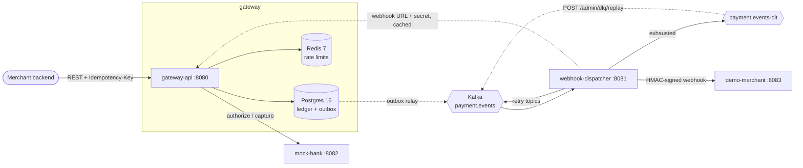

| Module | Port | What it does |
|---|---|---|
| `gateway-api` | 8080 | Payments REST API, API-key security, idempotency, double-entry ledger, reconciler, outbox relay |
| `mock-bank` | 8082 | Fake card processor: approves, declines or times out, idempotent on `paymentId` |
| `webhook-dispatcher` | 8081 | Delivers signed webhooks from Kafka, with retry topics, a per-merchant bulkhead and a DLT |
| `demo-merchant` | 8083 | Receives webhooks, verifies the signature, dedupes, can be told to fail |
| `ledger-audit-lambda` | — | Nightly AWS Lambda: audits the ledger in RDS, writes a report to S3 |

On AWS the four apps run on EKS, and Postgres is RDS. Redis and Kafka stay in-cluster: the money is
in Postgres, and the outbox can republish any event
([why](docs/DESIGN.md#only-postgres-became-managed-redis-and-kafka-stay-in-cluster)).

## Tech stack

| Area | Used |
|---|---|
| Language / framework | Java 21 (virtual threads), Spring Boot 3.3, Spring Security, Spring Kafka, springdoc-openapi |
| Data | PostgreSQL 16 (Flyway migrations), Spring Data JPA + `JdbcClient` where locking matters, Redis 7 |
| Messaging | Kafka (KRaft) |
| Tests | JUnit 5, Mockito, AssertJ, Testcontainers, WireMock, k6 |
| Observability | Micrometer + Prometheus, Grafana, JSON logs with trace and payment ids |
| Platform | Docker, Helm, kind, AWS (VPC, EKS, RDS, ECR, S3, Lambda, EventBridge Scheduler), Terraform, GitHub Actions (OIDC) |

## Run it

Needs Java 21, Maven, and Docker.

```bash
make up        # Postgres, Redis, Kafka, Prometheus, Grafana (docker compose), waits until healthy
make run-all   # builds and starts all four apps; logs in logs/<app>.log
make test      # unit + integration tests (Testcontainers)
```

### On Kubernetes (kind)

Needs Docker, [kind](https://kind.sigs.k8s.io/), kubectl and Helm. Ports 80 and 443 must be free, and
Docker needs ~6 GB of free memory (stop the compose stack with `make down` first).

```bash
make kind-up     # kind cluster (1 control plane + 2 workers), images, ingress-nginx, metrics-server,
                 # kube-prometheus-stack and the ledgerline chart (infra/helm/ledgerline); ~10 min the first time
make kind-down   # delete the cluster
```

- Gateway API: <http://api.localtest.me/swagger-ui.html> (`*.localtest.me` resolves to 127.0.0.1)
- Grafana: <http://grafana.localtest.me> (Ledgerline dashboard is the home page; `admin`/`admin` to edit)
- `kubectl -n ledgerline get pods,hpa`, and `kubectl -n ledgerline logs deploy/ledgerline-demo-merchant -f` for webhooks

The `curl` examples below work against the cluster too, if you replace `localhost:8080` with `api.localtest.me`.
Debugging commands (logs, exec, jcmd, network tools, psql, lock contention): [docs/RUNBOOK.md](docs/RUNBOOK.md).

### On AWS (EKS + RDS)

Terraform in `infra/terraform` creates everything in **us-east-1**:
- a VPC;
- EKS with **3 × c7i-flex.large** managed nodes;
- **RDS PostgreSQL 16 (db.t4g.micro)**;
- ECR and an S3 bucket;
- the nightly ledger-audit Lambda;
- a GitHub OIDC deploy role.

Public traffic reaches the gateway through an **ALB** created by the AWS Load Balancer Controller,
which accepts only allowed source CIDRs. GitHub Actions (`.github/workflows/deploy.yml`) builds
linux/amd64 images and deploys with Helm.

**It costs about $0.21 per hour while it exists, plus the EC2 cost of the 3 nodes** (see
[DEPLOY.md](docs/DEPLOY.md#costs); free-tier usage or account credits may cover part of the EC2 portion).

```bash
make aws-up      # scripts/aws-up.sh: terraform apply + cluster add-ons + secrets (asks first)
make aws-down    # scripts/aws-down.sh: destroy everything, then verify nothing chargeable is left
```

It was deployed through the GitHub Actions OIDC pipeline and verified on 2026-09-29:
- the ALB health check;
- the audit Lambda, which passed all checks and wrote its report to S3;
- Prometheus and Grafana on EKS.

It was then torn down: `aws-down.sh` destroyed 98 Terraform-managed resources and verified nothing
chargeable remained. Cost was guarded by an AWS Budget ($10/month).

Prerequisites, GitHub variables, first deploy, redeploy, teardown and common failures:
[docs/DEPLOY.md](docs/DEPLOY.md).

## Try it

Swagger UI: <http://localhost:8080/swagger-ui.html>. Click **Authorize**, paste a demo key into
`ApiKey`, and every endpoint can be tried from the browser.

```bash
KEY=sk_test_chaipoint_7Qm2xK9vLp4R

# Charge a card. Amounts are integers in paise: 49900 = ₹499.00
curl -i -X POST localhost:8080/v1/payments \
  -H "X-Api-Key: $KEY" -H "Idempotency-Key: order-1042-attempt" -H "Content-Type: application/json" \
  -d '{"amount": 49900, "currency": "INR", "cardToken": "tok_visa_4242", "merchantOrderId": "order-1042"}'

# Send the same request again: same response, plus "Idempotent-Replayed: true", and no second charge.

# Force an outcome with a magic card token: tok_approve, tok_decline, tok_timeout.
# tok_timeout returns 202 UNKNOWN after 2s; the reconciler resolves it within ~15s.

curl -H "X-Api-Key: $KEY" "localhost:8080/v1/payments?limit=20"            # newest first
curl -H "X-Api-Key: $KEY" "localhost:8080/v1/payments?cursor=<nextCursor>"  # next page

curl -X POST localhost:8080/v1/payments/<id>/refunds \
  -H "X-Api-Key: $KEY" -H "Idempotency-Key: refund-1" -H "Content-Type: application/json" \
  -d '{"amount": 10000}'

curl -u admin:admin-dev-password localhost:8080/admin/ledger/verify       # ledger audit
```

mock-bank's behaviour is configurable with environment variables: `BANK_APPROVE_RATE` (0.85),
`BANK_DECLINE_RATE` (0.10), `BANK_TIMEOUT_RATE` (0.05), `BANK_LATENCY_MIN`/`MAX` (50ms/300ms), and
`BANK_TIMEOUT_SLEEP` (5s).

### Demo credentials

These are for local development only. The migration stores only the SHA-256 hashes of the API keys.

| Merchant | API key (`X-Api-Key`) |
|---|---|
| Chai Point | `sk_test_chaipoint_7Qm2xK9vLp4R` |
| Book Nook | `sk_test_booknook_3Hd8wN5tYc1F` |
| Pixel Prints | `sk_test_pixelprints_9Ze6bJ2rVs7M` |

| Who | Credential | Default | Override with |
|---|---|---|---|
| Operator (`/admin/**`) | HTTP Basic | `admin` / `admin-dev-password` | `ADMIN_USERNAME`, `ADMIN_PASSWORD` |
| Internal services (`/internal/**`) | `X-Service-Token` header | `dev-internal-service-token` | `INTERNAL_SERVICE_TOKEN` |

On AWS, these secrets are generated by Terraform and stored in SSM, never in git
([how](docs/DESIGN.md#secrets-generated-by-terraform-never-in-state-never-in-git)).

## Webhooks

Every captured, failed or refunded payment is sent to the merchant's webhook URL (the demo merchants
all point at demo-merchant, whose log shows each event). The body is the event JSON:

```json
{"id": "<event id>", "type": "payment.captured", "merchantId": 1, "createdAt": "…", "data": { …same as the API's payment… }}
```

Types: `payment.captured`, `payment.failed`, `refund.created`. Delivery is **at-least-once**: dedupe
on `id` (also sent as `X-Ledgerline-Event-Id`).

**Verifying the signature** (`X-Ledgerline-Signature: t=<unix seconds>,v1=<hex>`):
1. Split the header into `t` and `v1`.
2. Compute `HMAC-SHA256(webhook secret, t + "." + raw request body)` as lowercase hex.
3. Compare it with `v1` in constant time, and reject `t` more than 5 minutes from now.

Always use the raw body bytes; parsing and re-serializing the JSON changes them.
[`SignatureVerifier`](demo-merchant/src/main/java/com/ledgerline/merchant/SignatureVerifier.java) is a
complete example.

Failed deliveries (non-2xx or no answer within 5 s) are retried after 10 s, 1 m, 6 m and 30 m, then
parked in the dead-letter topic. To see it happen, simulate a flaky merchant:

```bash
FAIL_RATE=0.5 java -jar demo-merchant/target/demo-merchant.jar   # half of all webhooks get a 500
curl -s localhost:8081/actuator/prometheus | grep -E '^(webhook_|dlq_size)'
curl -u admin:admin-dev-password -X POST localhost:8081/admin/dlq/replay   # send dead letters again
```

Swagger UI for the replay endpoint: <http://localhost:8081/swagger-ui.html>.

## Correctness guarantees

- **Every journal entry balances** (debits = credits). A deferred constraint trigger enforces this
  in Postgres at COMMIT, not only in Java. [→](docs/DESIGN.md#invariants-enforced-by-postgres)
- **The ledger is append-only.** Triggers reject UPDATE, DELETE and TRUNCATE on journal entries and postings.
  A refund is a new, reversing entry.
- **Money and its event commit together.** The payment status, the ledger entry, the outbox event
  and the idempotency record are written in one transaction.
- **One payment per idempotency key.** Proven under load: 600 keys × 10 simultaneous requests gave
  600 payments and 0 duplicates.
- **Checked continuously.** Every load test ends with `/admin/ledger/verify`. On AWS, the audit
  Lambda re-checks balances, cached balances, global net = 0 per currency, and stale UNKNOWN
  payments every night.

## Observability

- **Grafana:** <http://localhost:3000/d/ledgerline>. The Prometheus datasource and the Ledgerline
  dashboard are provisioned from `infra/grafana/` and `infra/helm/ledgerline/dashboards/`. Open it
  anonymously, or log in as `admin`/`admin`. It shows:
  - request rate, p50/p95/p99 latency, 4xx/5xx, and 429s per tier;
  - payment, bank and ledger timings;
  - outbox lag and webhook outcomes;
  - JVM heap and the Hikari pool.

  On EKS it's reached with `kubectl port-forward` ([DEPLOY.md](docs/DEPLOY.md#4-first-deploy)).
- **Prometheus:** <http://localhost:9090/targets>. It scrapes all four apps on the host every 5 s.
- **Logs** are one JSON object per line, with `traceId`, `spanId` and, where it applies,
  `paymentId` / `eventId`. Each log file starts with Spring's text banner, so keep only the JSON
  lines before `jq`:

  ```bash
  grep '^{' logs/gateway-api.log | jq .                                      # pretty-print one app
  grep -h '^{' logs/*.log | jq -c 'select(.paymentId == "<id>")'             # one payment across every app
  SPRING_PROFILES_ACTIVE=plain-logs java -jar gateway-api/target/gateway-api.jar   # plain text instead
  ```

## Load testing

k6 scenarios live in [infra/k6/](infra/k6/README.md): `steady` (constant arrival rate), `spike`
(50 → 800 → 50 req/s) and `duplicate_storm` (10 identical requests per key at the same instant).
Every scenario ends with a ledger audit, and the run fails unless every entry balances and the
global net is 0.

There are two kinds of result, and they are kept apart.

### Local benchmark (the capacity numbers)

MacBook, with the whole stack and k6 on one machine, two PRO merchants, mock-bank without synthetic
timeouts. Each row is a single run.

| Run | p50 / p95 / p99 | Errors | Dropped | Ledger |
|---|---|---|---|---|
| steady 200 req/s | 69 / 108 / 174 ms | 0.00% | 0 | balanced, net 0 |
| steady 231 req/s | 71 / 118 / 176 ms | 0.00% | 0 | balanced, net 0 |
| steady 232 req/s (first failing point) | 73 / 155 / **360 ms** | 0.00% | 19 | balanced, net 0 |
| spike 800 req/s (spike phase) | 3959 / 6038 / **6957 ms** | 0.01% | 25 378 | balanced, net 0 |
| duplicate_storm (600 keys × 10) | 148 / 284 / 535 ms | 0.00% | 0 | balanced, net 0; 600 payments, 0 duplicates |

**Healthy up to about 230 req/s on that machine** (p99 < 300 ms, 0% errors). 232 req/s is the first
point that fails. The spike (800 req/s) is far past capacity, and it fails its latency thresholds,
as expected. Correctness held in every run. Details:
[DESIGN.md](docs/DESIGN.md#results-local-benchmark-where-the-payment-path-saturates) and
[infra/k6/results/](infra/k6/results/steady.md).

### AWS: diagnostic only, not a benchmark

On EKS + RDS, a `steady` run at 50 req/s **failed** its latency and error thresholds, while the
ledger stayed balanced (net 0). It is **not** a throughput result. It is kept because it exposed
the scaling limit below. No threshold was relaxed.
[Diagnostic write-up](docs/DESIGN.md#aws-diagnostic-run-not-a-benchmark) ·
[result file](infra/k6/results/aws-diagnostic-steady-50.md)

## Known scaling limits

**Two hot ledger rows cap throughput. This is not fixed yet.**

Every capture posts to the merchant's account *and* to two platform-wide accounts, `CUSTOMER_FUNDS`
and `PLATFORM_FEES`. To keep balances correct without deadlocks, the transaction locks all three in
id order:

```sql
SELECT id FROM accounts WHERE id IN (...) ORDER BY id FOR UPDATE
```

It holds those locks until COMMIT. So every payment, for every merchant, waits in one queue for the
same two rows.
- **Locally,** this is the knee at about 230 req/s.
- **On AWS,** each statement inside the lock is also a network round trip to RDS, so the locks
  are held longer:
  - Postgres showed sessions waiting in `Lock:tuple` and `Lock:transactionid` on that query.
  - Grafana showed ledger-post p99 of several seconds and the gateway's Hikari pool queueing.
  - Adding gateway pods doesn't help; it only adds waiters.
- **The invariants held throughout** (`balanced = true`, `globalNet = 0`).

The root-cause analysis: this is **primarily a design bottleneck, amplified by RDS/network latency**.

There is also a **secondary race.** A request stuck for more than 10 s loses its idempotency lock.
The reconciler can then resolve the payment first, and the original request fails its version check.
The client gets an error, but the money is still correct.

Options, none of them built yet:
- shard the platform accounts into N sub-accounts;
- take their cached balances off the hot path;
- shorten the lock window;
- fail fast under overload;
- make the idempotency lease safe under slow databases.

Full analysis: [DESIGN.md: Known scaling limits](docs/DESIGN.md#known-scaling-limits). How to see
it live: [RUNBOOK §8](docs/RUNBOOK.md#8-lock-contention-on-the-ledger).

## Screenshots

All from the AWS deployment on 2026-09-29.

### Deployment

| | |
|---|---|
| 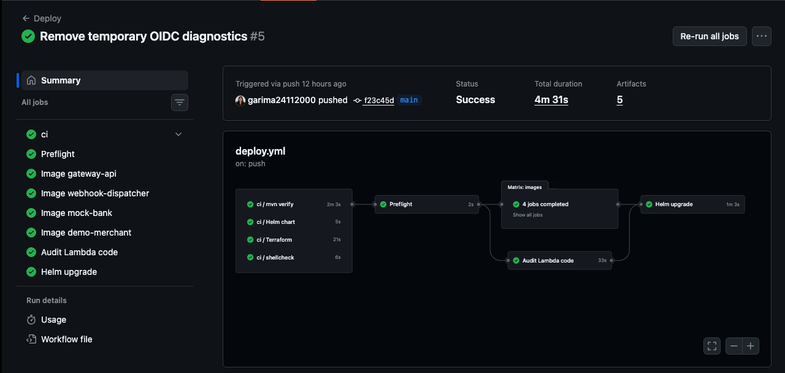 | 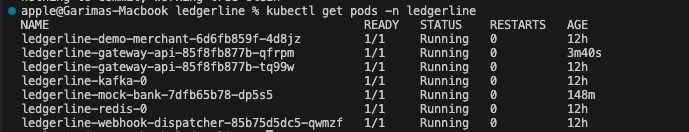 |
| GitHub Actions `deploy.yml` on `main`, authenticated with OIDC: CI → preflight → 4 images + audit Lambda code → Helm upgrade, green in 4m31s. | Ledgerline pods on EKS: two gateway-api replicas, webhook-dispatcher, mock-bank, demo-merchant, Kafka and Redis, all Running. |
| 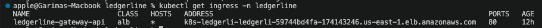 | 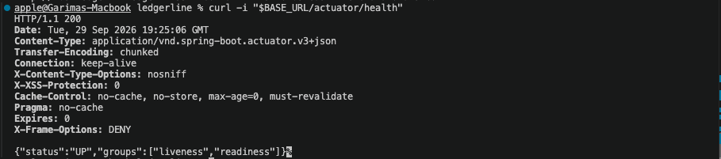 |
| The gateway's Ingress, class `alb`, provisioned by the AWS Load Balancer Controller. | `/actuator/health` through the public ALB: `HTTP 200`, `{"status":"UP"}`. |

### Ledger audit (Lambda + S3)

| | |
|---|---|
| 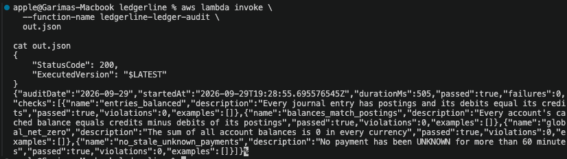 | 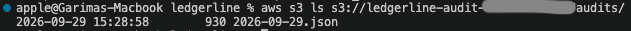 |
| Invoking the audit Lambda: `passed: true`, `failures: 0`, 505 ms. | The report written to `audits/2026-09-29.json` in the audit bucket. |

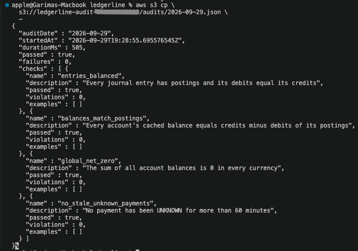

The report: `entries_balanced`, `balances_match_postings`, `global_net_zero` and
`no_stale_unknown_payments` all passed with 0 violations.

### Observability on EKS, during the AWS diagnostic load

These were taken while the AWS load tests were running. The latency and queueing spikes show the
[hot-row contention](#known-scaling-limits), not normal operation.

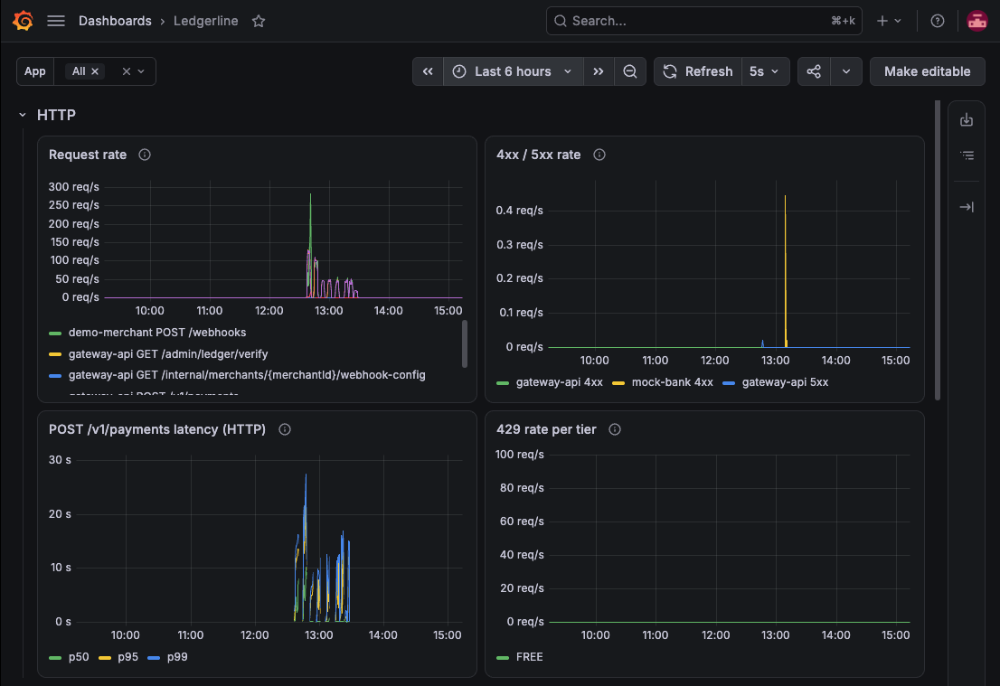
HTTP: request rate, 4xx/5xx, and POST `/v1/payments` latency. During the runs, p99 spikes reach
roughly 25 s, and there are no 429s: excess load queued instead of being rejected.

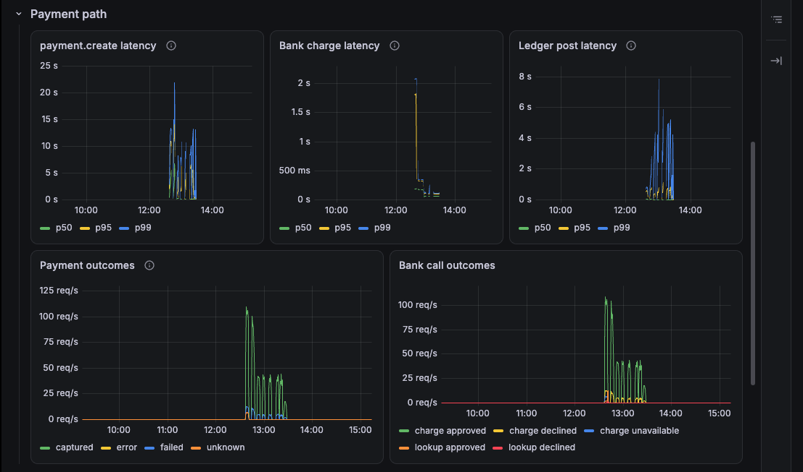
Payment path: bank charge latency stays low after warm-up, while ledger-post p99 reaches several
seconds (up to about 8 s). The time is spent in the ledger transaction, not at the bank.

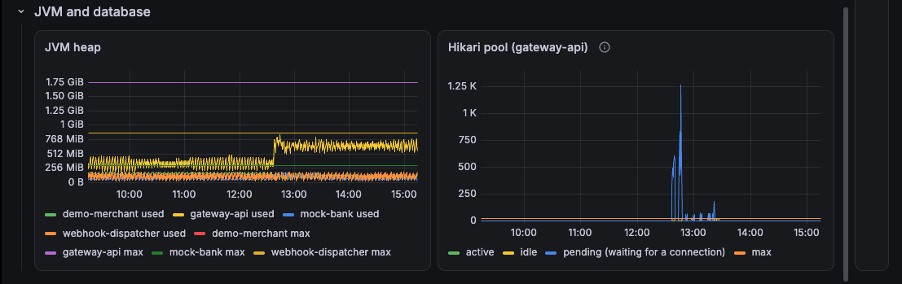
JVM and database: heap stays well below its max, but the gateway's Hikari "pending" count peaks at
about 1,250 requests waiting for a connection.

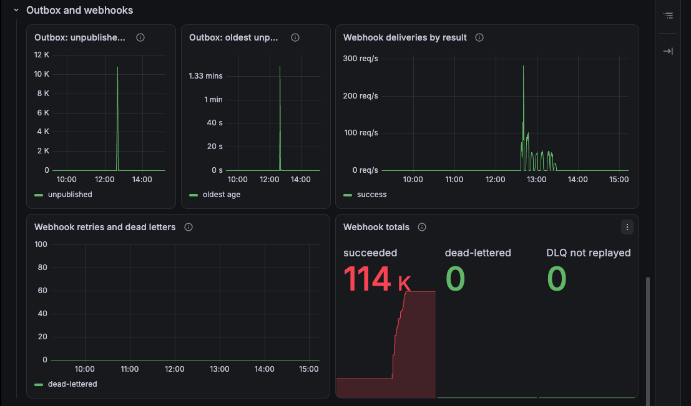
Outbox and webhooks: a brief outbox backlog drains, 114K webhooks succeeded, and 0 were
dead-lettered.

### Diagnosis and cost

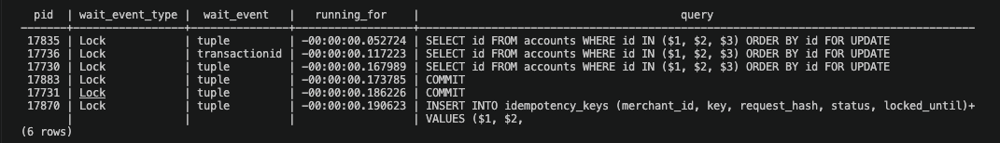
One `pg_stat_activity` snapshot on RDS. Sessions wait in `Lock:tuple` / `Lock:transactionid` on
`SELECT id FROM accounts WHERE id IN (...) ORDER BY id FOR UPDATE`, and on `COMMIT` and an
idempotency-key insert. That is the hot-row queue.

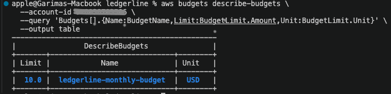
Cost guard: AWS Budget `ledgerline-monthly-budget`, $10/month.

## Design decisions

The short version. Each links to the reasoning in DESIGN.md.
- **READ COMMITTED + `FOR UPDATE` in id order** for money movement, rather than SERIALIZABLE. There
  is no retry loop, and deadlocks can't form.
  [→](docs/DESIGN.md#read-committed-vs-repeatable-read-vs-serializable-in-postgres)
- **Pessimistic over optimistic locking on the ledger.** Conflicts on the platform rows are the
  common case, and optimistic retries would storm exactly at peak load. The cost is the serialization
  described [above](#known-scaling-limits).
  [→](docs/DESIGN.md#optimistic-version-vs-pessimistic-for-update-locking)
- **Never hold a DB transaction across the bank call.** Each step is its own short transaction, and
  a crash between them leaves a PENDING payment for the reconciler.
  [→](docs/DESIGN.md#creating-a-payment)
- **Transactional outbox over dual writes**, with at-least-once delivery and dedupe by event id.
  [→](docs/DESIGN.md#what-is-the-dual-write-problem)
- **Retry topics over in-place retries**, so one failing merchant doesn't block a partition.
  [→](docs/DESIGN.md#retries-retry-topics-not-in-place-retries)
- **Rate limits shared through Redis** so they hold across replicas, failing open.
  [→](docs/DESIGN.md#why-is-the-limit-shared-through-redis-rather-than-kept-in-each-instance)
- **Only Postgres is managed on AWS.** It holds the money, and Redis and Kafka are recoverable.
  [→](docs/DESIGN.md#only-postgres-became-managed-redis-and-kafka-stay-in-cluster)
- **Secrets as Terraform write-only values** (never in state or git), and **GitHub OIDC** restricted
  to `main` of this repository instead of stored AWS keys.
  [→](docs/DESIGN.md#github-oidc-main-branch-of-this-repository-only)

## What I'd do in production

- **Ledger scaling:**
  - Shard `CUSTOMER_FUNDS` / `PLATFORM_FEES` into N sub-accounts, or keep platform balances off
    the hot path (derive them from postings, or roll them up asynchronously).
  - Shorten the hot-row lock window by inserting immutable journal/posting rows before the shared
    balance updates, and apply the shared account balance updates in deterministic order at the end
    of the transaction.
  - Add a global concurrency limit and a short Hikari connection timeout, so overload gets a fast
    503 instead of a queue.
  - Make the idempotency lease safe under database latency (renew it, or size it to the real worst
    case), so a slow request can't lose its key to the reconciler.
- **Database:**
  - Multi-AZ RDS, longer backups, a final snapshot and deletion protection.
  - `sslmode=verify-full`.
  - An app role with only `SELECT, INSERT` on the ledger tables, and a separate migration owner.
  - A connection pooler (RDS Proxy or PgBouncer).
- **Messaging and cache:** MSK (3 brokers, TLS/IAM) and ElastiCache (TLS/AUTH), after adding
  client support for both in the apps.
- **Edge:**
  - Route 53 + ACM with an HTTPS listener and HTTP→HTTPS redirect, instead of plain HTTP limited
    to allowed CIDRs.
  - AWS WAF in front of the ALB.
- **Platform:**
  - Terraform state in S3 with locking.
  - One NAT gateway per AZ.
  - EKS control-plane logs.
  - Secret rotation (Secrets Manager or External Secrets).
  - Image scanning and signing.
- **Operations:**
  - SLO-based alerts on p99, Hikari pending, outbox lag and the DLQ.
  - Load tests as an in-cluster k6 Job against a production-like environment, with profiling at
    the capacity boundary.

## Measuring the queries

The indexes behind the endpoint and job queries are measured with EXPLAIN ANALYZE; results and
plans are in DESIGN.md.

```bash
make seed-payments      # 1M payments for the demo merchants (~15 s)
make explain-payments   # payment list query, with and without the (merchant_id, created_at, id) index
make explain-outbox     # seeds 1M published + 1k unpublished events in a transaction, EXPLAINs, rolls back
make explain-audit      # the four ledger-audit Lambda queries
```

## Documentation

- [docs/DESIGN.md](docs/DESIGN.md): architecture, decisions, trade-offs, measurements, known limits
- [docs/DEPLOY.md](docs/DEPLOY.md): AWS setup, deploy, redeploy, teardown, costs, common failures
- [docs/RUNBOOK.md](docs/RUNBOOK.md): debugging on Kubernetes (logs, jcmd, network, RDS, ALB, lock contention)
- [infra/k6/README.md](infra/k6/README.md): running the load tests and reading the results
