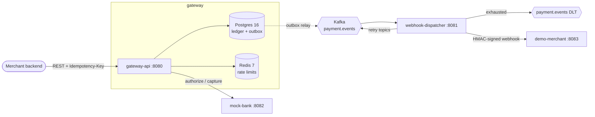

# Ledgerline — Design Notes

## Architecture

| Module | Port | Responsibility |
|---|---|---|
| `gateway-api` | 8080 | Payments REST API, idempotency, double-entry ledger, outbox relay, rate limiting |
| `webhook-dispatcher` | 8081 | Consumes `payment.events`, delivers signed webhooks with retry topics + DLT |
| `mock-bank` | 8082 | Fake card processor: randomly succeeds, fails, is slow, or times out |
| `demo-merchant` | 8083 | Receives webhooks, verifies HMAC, logs them, can be told to fail |

Every app exposes `/actuator/health` (with liveness/readiness probes for Kubernetes) and
`/actuator/prometheus`, and runs request handling on Java 21 virtual threads
(`spring.threads.virtual.enabled=true`). gateway-api serves Swagger UI at `/swagger-ui.html`.

## Decisions

### Project layout
- **Maven multi-module with one parent pom.** The parent inherits `spring-boot-starter-parent` 3.3.13
  so all modules share one dependency set. Dependencies every app needs (web, actuator,
  Prometheus registry, test starter) are declared once in the parent.
- **Dependencies arrive with the features that use them.** For example, Kafka and Redis clients are
  not on the classpath yet, so auto-configuration doesn't try to connect to services nothing uses.

### Database
- **Flyway owns the schema, Hibernate only validates it** (`ddl-auto: validate`). This fits the
  rule that invariants live in Postgres: constraints and triggers are written by hand in SQL
  migrations, never generated. `V1__init.sql` is an empty baseline.
- Flyway 10 needs `flyway-database-postgresql` alongside `flyway-core`.
- `open-in-view: false`, so no lazy loading can happen in the web layer, and each transaction
  boundary is explicit in the service layer.

### Testing
- **Unit tests are `*Test` (Surefire); integration tests are `*IT` (Failsafe, run during `mvn verify`).**
  This keeps the fast feedback loop fast, while `mvn verify` still runs everything.
- **Integration tests use real Postgres through Testcontainers**, wired in with `@ServiceConnection`
  (no hand-written JDBC URL properties). An in-memory H2 would hide Postgres-specific behavior
  (constraints, triggers, `SELECT ... FOR UPDATE SKIP LOCKED`), and the ledger depends on exactly that.
- **Docker 29 compatibility.** Testcontainers' bundled docker-java defaults to Docker API 1.32.
  Docker Engine 29 requires at least 1.40 and answers with an empty `400`, which Testcontainers reports as
  "Could not find a valid Docker environment". The parent pom sets `api.version=1.44` as a Failsafe
  system property, so the fix lives in the repo, not in each developer's `~/.docker-java.properties`.
  Testcontainers is also raised to 1.21.x (Boot 3.3 ships 1.20.x).
- **ITs use `@AutoConfigureObservability`.** `@SpringBootTest` disables metrics exporters by default,
  so `/actuator/prometheus` returns 404 in tests unless the annotation re-enables them.

### Local infrastructure (`infra/docker-compose.yml`)
- **Kafka runs single-node KRaft** (`apache/kafka`): one process is both broker and controller, with no ZooKeeper.
- **Two client listeners.** A Kafka client uses the bootstrap address only for its first
  connection. After that it connects to whatever address the broker *advertises*, so a single
  listener can't serve both the host and other containers:
  - `EXTERNAL` → advertised as `localhost:9092`, for apps on the host (IDE, `make run-all`).
  - `INTERNAL` → advertised as `kafka:29092`, for containers on the compose network (the
    inter-broker listener too).
  - `CONTROLLER` → `:9093`, used only for KRaft quorum traffic and never published.
- **Postgres is published on host port 5433**, not 5432, so it doesn't clash with a natively
  installed Postgres (common on dev laptops). Containers still use `postgres:5432`. gateway-api
  defaults to `localhost:5433`, overridable with `DB_URL` / `DB_USERNAME` / `DB_PASSWORD`.
- All services have healthchecks, and `make up` uses `docker compose up --wait`, so it returns only
  once Postgres, Redis and Kafka are ready.

### Security
- Spring Security is on the classpath but **temporarily permits all requests** (CSRF disabled, since
  this is a stateless JSON API). Merchant API-key auth replaces this once payments exist.
