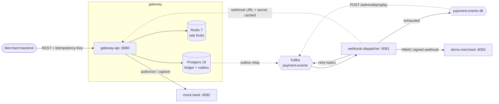
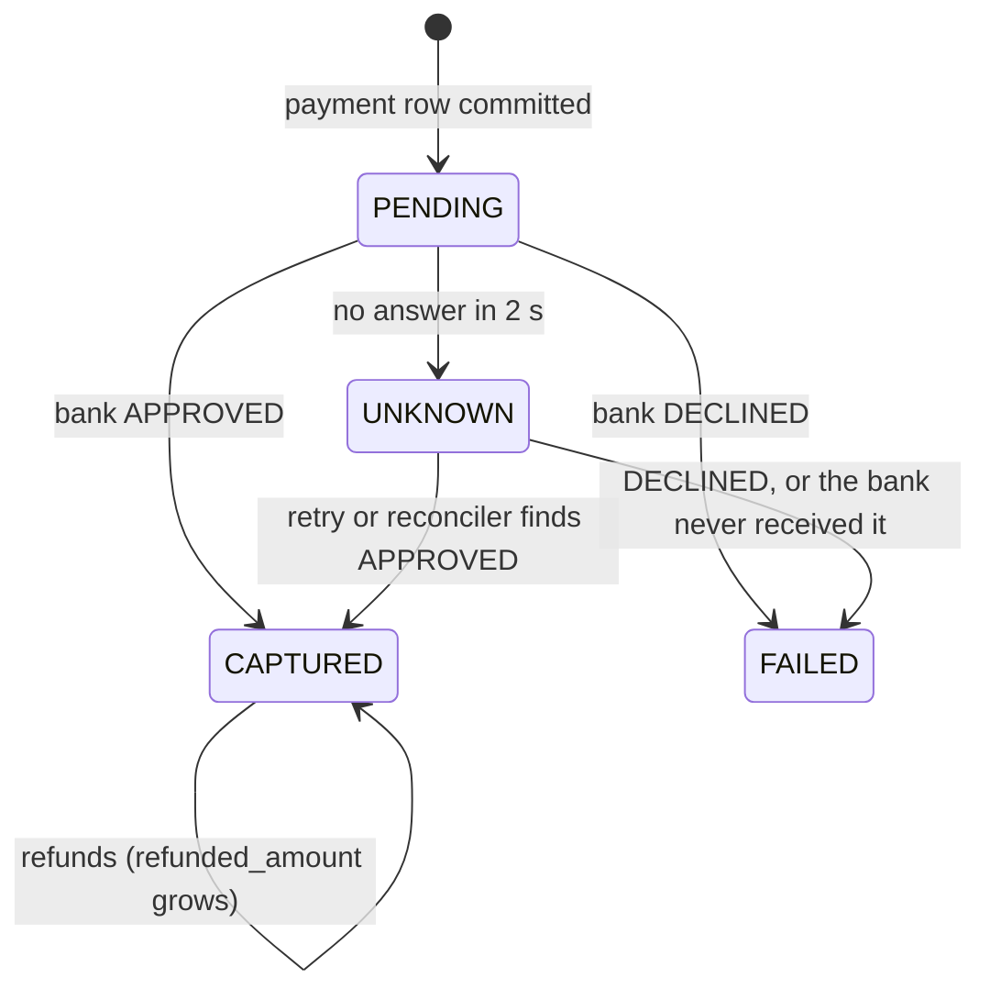
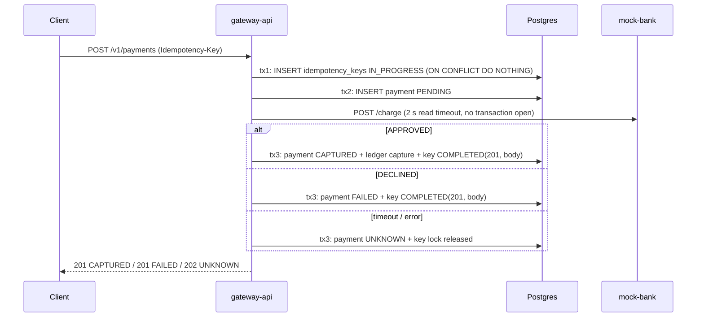
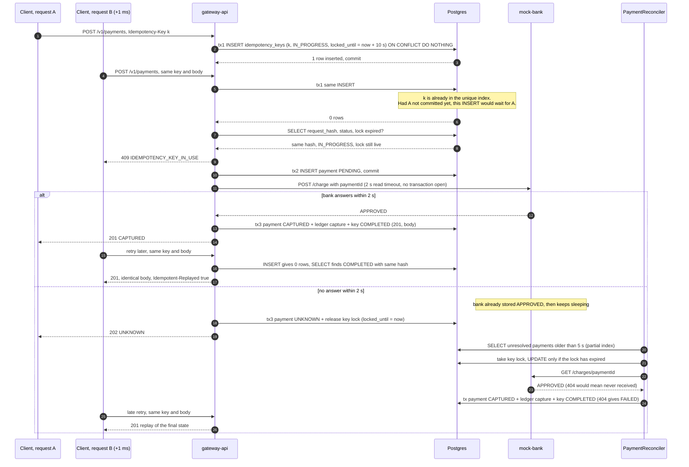

# Ledgerline — Design Notes

## Architecture



| Module | Port | Responsibility |
|---|---|---|
| `gateway-api` | 8080 | Payments REST API, idempotency, double-entry ledger, outbox relay, rate limiting |
| `webhook-dispatcher` | 8081 | Consumes `payment.events`, delivers signed webhooks with retry topics + DLT |
| `mock-bank` | 8082 | Fake card processor: randomly succeeds, fails, is slow, or times out |
| `demo-merchant` | 8083 | Receives webhooks, verifies HMAC, logs them, can be told to fail |

Every app exposes `/actuator/health` (with liveness/readiness probes for Kubernetes) and
`/actuator/prometheus`, and runs request handling on Java 21 virtual threads
(`spring.threads.virtual.enabled=true`). gateway-api, webhook-dispatcher and demo-merchant serve
Swagger UI at `/swagger-ui.html`.

## Decisions

### Project layout
- **Maven multi-module with one parent pom.** The parent inherits `spring-boot-starter-parent` 3.3.13
  so all modules share one dependency set. Dependencies every app needs (web, actuator,
  Prometheus registry, test starter) are declared once in the parent.
- **Dependencies arrive with the features that use them**, so auto-configuration never connects to
  a service nothing uses. Kafka arrived with the outbox (gateway-api) and the dispatcher, and Redis
  with rate limiting.

### Database
- **Flyway owns the schema, Hibernate only validates it** (`ddl-auto: validate`). This fits the
  rule that invariants live in Postgres: constraints and triggers are written by hand in SQL
  migrations, never generated. `V1__init.sql` is an empty baseline; `V2__ledger.sql` adds merchants
  and the ledger (see [Ledger](#ledger)); `V3__payments.sql` adds payments, refunds, idempotency keys
  and the demo merchants (see [Payments](#payments)); `V4__outbox.sql` adds the transactional outbox
  (see [Outbox](#outbox)); `V5__rate_limit_tiers.sql` reduces the tiers to FREE and PRO (see
  [Rate limiting](#rate-limiting)).
- Flyway 10 needs `flyway-database-postgresql` alongside `flyway-core`.
- `open-in-view: false`, so no lazy loading can happen in the web layer, and each transaction
  boundary is explicit in the service layer.

### Testing
- **Unit tests are `*Test` (Surefire); integration tests are `*IT` (Failsafe, run during `mvn verify`).**
  This keeps the fast feedback loop fast, while `mvn verify` still runs everything.
- **Integration tests use real Postgres through Testcontainers**, wired in with `@ServiceConnection`
  (no hand-written JDBC URL properties). An in-memory H2 would hide Postgres-specific behavior
  (constraints, triggers, `SELECT ... FOR UPDATE SKIP LOCKED`), and the ledger depends on exactly that.
- **Docker 29 compatibility.** Testcontainers' bundled docker-java defaults to Docker API 1.32.
  Docker Engine 29 requires at least 1.40 and answers with an empty `400`, which Testcontainers reports as
  "Could not find a valid Docker environment". The parent pom sets `api.version=1.44` as a Failsafe
  system property, so the fix lives in the repo, not in each developer's `~/.docker-java.properties`.
  Testcontainers is also raised to 1.21.x (Boot 3.3 ships 1.20.x).
- **ITs use `@AutoConfigureObservability`.** `@SpringBootTest` disables metrics exporters by default,
  so `/actuator/prometheus` returns 404 in tests unless the annotation re-enables them.
- **gateway-api ITs share one base class, `AbstractGatewayIT`.** It starts one Postgres container, one
  Kafka container and one WireMock server in a static block (the "singleton container" pattern) and fixes a single set
  of test properties. Every IT class therefore reuses **one** cached Spring context. With per-class
  `@Container` fields, each class would start its own database, and a cached context could outlive
  the container it points at.
- **The bank is WireMock in gateway ITs, not the real mock-bank.** Tests need exact outcomes, real
  delays (to trigger the 1 s read timeout), and to count how many charges reached the bank
  ("exactly one charge for 20 concurrent requests"). mock-bank has its own tests in its module.

### Local infrastructure (`infra/docker-compose.yml`)
- **Kafka runs single-node KRaft** (`apache/kafka`): one process is both broker and controller, with no ZooKeeper.
- **Two client listeners.** A Kafka client uses the bootstrap address only for its first
  connection. After that it connects to whatever address the broker *advertises*, so a single
  listener can't serve both the host and other containers:
  - `EXTERNAL` → advertised as `localhost:9092`, for apps on the host (IDE, `make run-all`).
  - `INTERNAL` → advertised as `kafka:29092`, for containers on the compose network (the
    inter-broker listener too).
  - `CONTROLLER` → `:9093`, used only for KRaft quorum traffic and never published.
- **Postgres is published on host port 5433**, not 5432, so it doesn't clash with a natively
  installed Postgres (common on dev laptops). Containers still use `postgres:5432`. gateway-api
  defaults to `localhost:5433`, overridable with `DB_URL` / `DB_USERNAME` / `DB_PASSWORD`.
- All services have healthchecks, and `make up` uses `docker compose up --wait`, so it returns only
  once Postgres, Redis and Kafka are ready.

### Security
See [Security](#security-1) under Payments.

## Ledger

Code: `gateway-api/.../ledger/`, schema: `V2__ledger.sql`.

### Model
- **Accounts** hold a cached `balance`. **Journal entries** group **postings**. Each posting
  debits or credits one account by a positive amount (`BIGINT` paise).
- **Sign convention: `balance = credits − debits` for every account.** One rule, with no
  per-account "normal side". Because every entry balances, **the sum of all balances is always 0**,
  and `/verify` reports that sum as the global net.
- **Chart of accounts**

  | Account | Owner | `allow_negative` | Meaning |
  |---|---|---|---|
  | `CUSTOMER_FUNDS` | platform | yes | Clearing account money arrives through. It is debited on capture, so it goes negative by design. |
  | `MERCHANT_PAYABLE` | one per merchant | no | What we owe the merchant. It can never go below 0, so a refund larger than the merchant's balance fails in the DB. |
  | `PLATFORM_FEES` | platform | no | Our revenue. |
  | `REFUNDS` | platform | yes | Seeded, still unused: refunds mirror the capture instead (see [Refunds](#refunds-reversing-entries-that-telescope)). |

- **Capture of A with fee F:** debit `CUSTOMER_FUNDS` A, credit `MERCHANT_PAYABLE` A−F,
  credit `PLATFORM_FEES` F. When F rounds down to 0 (A < 50 paise), the fee posting is left out,
  because postings must be positive. The entry then has two postings instead of three.
- **Platform accounts have `owner_id NULL`** and are seeded by the migration. The unique index
  uses `NULLS NOT DISTINCT` (Postgres 15+); otherwise NULLs never collide and several
  `PLATFORM_FEES` accounts could be created. A CHECK ties the two together:
  `owner_type = 'PLATFORM'` ⇔ `owner_id IS NULL`.
- **Enum-like columns are `TEXT` + `CHECK`**, not Postgres `ENUM` types. Adding a value is a
  one-line migration, and Hibernate maps them with plain `@Enumerated(STRING)`.
- **Single currency (INR) for now.** Accounts carry `currency`, and the commit trigger rejects an
  entry whose postings span currencies. Multi-currency would need one account set per currency.

### Fees: 2% rounded down, without overflow
`Fees.captureFee` uses basis points (200 bp). `amount * 200 / 10_000` overflows `long` above
~4.6·10¹⁶, so the amount is split as `amount = q·10,000 + r` and the fee computed as
`q·200 + r·200/10,000`. This is exact floor division, and neither term can overflow. Unit tests
cover 1 and 49 (fee 0), 50 (fee 1), 99 (rounds down, not up), and `Long.MAX_VALUE`, checked against
`BigInteger`.

### Invariants enforced by Postgres
Java validates the same rules first (`JournalEntryRequest` rejects unbalanced input), but that only
gives nicer errors. The database is the authority:

| Invariant | Mechanism |
|---|---|
| Debits = credits per entry; an entry has ≥ 1 posting; one currency | `DEFERRABLE INITIALLY DEFERRED` constraint triggers on `journal_entries` and `postings` insert, calling `ledger_assert_entry_balanced(entry_id)` |
| Ledger is append-only | `BEFORE UPDATE OR DELETE` row triggers and `BEFORE TRUNCATE` statement triggers on both tables |
| Posting amount > 0 | `CHECK (amount > 0)` |
| No overdraft | `CHECK (allow_negative OR balance >= 0)` on `accounts` |
| A payment is captured at most once | partial unique index `journal_entries(payment_id) WHERE type = 'CAPTURE'` |

- **Why deferred:** the entry row and its postings are separate `INSERT`s, so the entry is
  unbalanced between statements. A deferred trigger checks at `COMMIT`, when the entry is
  complete. The integration test proves this: both raw-SQL inserts succeed, and only `commit()` fails.
- **Why a trigger on `journal_entries` too:** the `postings` trigger only fires if a posting
  exists. Without the second trigger, an entry with no postings at all would commit.
- **Trigger cost:** the check runs once per inserted row, so 4 times per 3-posting capture. Each run
  is an index lookup (~0.25 ms, see below). Bulk-loading 200k entries took 88 s at commit (~110 µs
  per trigger call), which is fine for OLTP but worth knowing for backfills.
- **Error codes:** the triggers raise `check_violation` / `integrity_constraint_violation`, so
  Spring translates them to `DataIntegrityViolationException` like any other constraint.
- **Limitation:** the table owner can still `ALTER TABLE ... DISABLE TRIGGER`. In production the
  app would connect as a role with only `SELECT, INSERT` on the ledger tables, and migrations would run
  as a separate owner role.

### Posting: one transaction, ordered row locks
`LedgerService.post` is `@Transactional` and does, in order:
1. Nets the postings per account in a `TreeMap`, which gives the account ids sorted ascending.
2. `SELECT id FROM accounts WHERE id IN (...) ORDER BY id FOR UPDATE`, which locks every affected
   account. It fails early if an id is unknown.
3. Inserts the entry and its postings.
4. `UPDATE accounts SET balance = balance + :delta, version = version + 1` per account.

- **Why a consistent lock order:** if T1 locks A and waits for B while T2 holds B and waits for A,
  Postgres detects a deadlock and aborts one of them. When every transaction locks in ascending id
  order, that cycle can't form. The plan below shows the `ORDER BY` is satisfied by the primary-key
  index scan under `LockRows`, so rows are locked in id order as they come off the index.
- **Hot rows:** every capture locks `CUSTOMER_FUNDS` and `PLATFORM_FEES`, so all captures across all
  merchants serialize on those two rows for the length of the transaction. This is fine at this
  project's scale. The usual fix is to split each platform account into N sub-accounts and pick one
  at random (sum them for reporting).
- **JPA vs SQL:** `Account` and `Merchant` are JPA entities (lookups, onboarding). The posting path
  is `JdbcClient` SQL, following the rule to use plain SQL where locking matters. `Account.balance`
  is mapped `insertable = false, updatable = false`, so a stale entity can never overwrite a balance.
  `@Version` makes any other JPA update optimistic-locked. `JpaTransactionManager` shares its JDBC
  connection with `JdbcClient`, so both run in the same transaction.
- **The concurrency test** fires 50 captures for one merchant at once on virtual threads, released
  together by a latch through a 10-connection pool. It asserts exact final balances on all three
  accounts, and that `/verify` is clean.
- **What the concurrency test doesn't show:** the `balance = balance + delta` update is atomic by
  itself, so it would not lose updates even without `FOR UPDATE`. The explicit lock matters for code
  that *reads* a balance and then decides, for example a refund checking funds or a payout. It also
  makes the lock order a visible, deliberate step instead of a side effect of update order.

### Cached balances and `/admin/ledger/verify`
The balance is cached on `accounts` so reads are O(1). The postings are the source of truth.
`GET /admin/ledger/verify` returns:
- `allEntriesBalanced` + `unbalancedEntryIds`: groups postings by entry.
- `balancesMatchPostings` + `mismatchedAccountIds`: compares each cached balance with
  credits − debits of its postings.
- `globalNet`: `SUM(accounts.balance)`, which must be 0. This checks the *cache*. The same sum over
  postings would be 0 whenever entries balance, so it would tell us nothing new.
- `consistent`: all of the above.

It runs `@Transactional(readOnly, REPEATABLE_READ)`, so all three queries read one snapshot. A
capture committing between them can't cause a false alarm. It always returns 200; callers
(monitoring, a scheduled job) check `consistent`.

**Trade-off:** cached-balance correctness is *detected* by `/verify`, not *enforced* by Postgres. A
posting-insert trigger could maintain balances itself, but that moves the business logic into
PL/pgSQL and hides it from the service layer. The integration test proves that drift is detected.

### Indexes

Measured on Postgres 16 with 1,003 accounts, 200,000 journal entries, and 600,000 postings (200 per
merchant account, 200,000 each on the platform accounts), after `VACUUM ANALYZE`.

| Index | Used by | With index | Without |
|---|---|---|---|
| `accounts(owner_type, owner_id, type)` UNIQUE `NULLS NOT DISTINCT` | Account lookup in `capture`; uniqueness | 0.11 ms index scan | — (uniqueness needs it anyway) |
| `postings(journal_entry_id)` | Commit-time balance trigger, run on every insert | 0.25 ms | 8.5 ms parallel seq scan, **growing with ledger size, on every write** |
| `journal_entries(payment_id)` | Finding a payment's entries (refunds, support) | 0.14 ms | 17 ms seq scan |
| `postings(account_id)` | Account statements, recomputing one account's balance, FK checks if an account is ever deleted | 1.9 ms (200 rows) | 8.3 ms seq scan |
| `accounts` PK | `SELECT ... FOR UPDATE` lock step | 0.13 ms | — |

**`accounts(owner_type, owner_id, type)`**: both lookups (merchant by id, platform by `IS NULL`) use
all three columns as index conditions:
```
Index Scan using accounts_owner_type_uq on accounts (actual time=0.070..0.071 rows=1 loops=1)
  Index Cond: ((owner_type = 'MERCHANT') AND (owner_id = 500) AND (type = 'MERCHANT_PAYABLE'))
Execution Time: 0.113 ms

Index Scan using accounts_owner_type_uq on accounts (actual time=0.024..0.025 rows=1 loops=1)
  Index Cond: ((owner_type = 'PLATFORM') AND (owner_id IS NULL) AND (type = 'PLATFORM_FEES'))
Execution Time: 0.032 ms
```

**Lock step** (primary key; ordered index scan feeding `LockRows`, no separate sort):
```
LockRows (actual time=0.106..0.116 rows=3 loops=1)
  ->  Index Scan using accounts_pkey on accounts (actual time=0.019..0.025 rows=3 loops=1)
        Index Cond: (id = ANY ('{1,503,2}'::bigint[]))
Execution Time: 0.131 ms
```

**`postings(journal_entry_id)`**: the most important index. The deferred trigger queries postings
by entry for every inserted row. Without the index, each capture would pay 4 sequential scans of
the whole postings table at commit, and that gets slower as the ledger grows. Postgres does not
create indexes on FK columns automatically.
```
Aggregate (actual time=0.167..0.168 rows=1 loops=1)
  ->  Sort (actual time=0.151..0.151 rows=3 loops=1)
        ->  Nested Loop (actual time=0.085..0.115 rows=3 loops=1)
              ->  Bitmap Heap Scan on postings p (actual time=0.076..0.102 rows=3 loops=1)
                    ->  Bitmap Index Scan on postings_journal_entry_id_idx (actual time=0.069..0.069 rows=3 loops=1)
                          Index Cond: (journal_entry_id = 123456)
              ->  Index Scan using accounts_pkey on accounts a (actual time=0.003..0.003 rows=1 loops=3)
Execution Time: 0.245 ms

-- same query without the index:
Parallel Seq Scan on postings p (actual time=1.479..5.655 rows=1 loops=3)
  Filter: (journal_entry_id = 123456)
  Rows Removed by Filter: 199999
Execution Time: 8.463 ms
```

**`journal_entries(payment_id)`**: the refund flow will look up a payment's capture and earlier
refunds by `payment_id`. The partial unique index (`WHERE type = 'CAPTURE'`) can't serve that query
because it only contains captures, so this general index is separate.
```
Index Scan using journal_entries_payment_id_idx on journal_entries (actual time=0.129..0.130 rows=1 loops=1)
  Index Cond: (payment_id = '01b4d174-...'::uuid)
Execution Time: 0.141 ms

-- without: Seq Scan on journal_entries, Rows Removed by Filter: 199999, Execution Time: 17.382 ms
```

**`postings(account_id)`**: merchant account statements and single-account reconciliation. It
also keeps FK checks on `accounts` from scanning `postings`. It pays off for selective accounts
(merchants). For the hot platform accounts, which hold a third of all postings each, the planner
correctly ignores it and seq-scans (12 ms), so platform-level reporting should read the cached
balance, not sum postings.
```
Aggregate (actual time=1.892..1.892 rows=1 loops=1)
  ->  Index Scan using postings_account_id_idx on postings (actual time=0.030..1.853 rows=200 loops=1)
        Index Cond: (account_id = 503)
Execution Time: 1.900 ms

-- without: Parallel Seq Scan on postings, Rows Removed by Filter: 199933, Execution Time: 8.255 ms
```

**`/verify` queries are full scans on purpose.** An audit has to read every posting, so no index
can make it cheaper. Measured: unbalanced-entry check 274 ms (the planner walks
`postings_journal_entry_id_idx` to feed a streaming `GroupAggregate`); balance-mismatch check 31 ms
(parallel seq scan + hash aggregate, merge-joined to the accounts PK); global net 0.1 ms. That is
acceptable for an operator endpoint or nightly job. At a much larger scale, verification would run
incrementally (only entries since the last checkpoint) or on a read replica.

### Why it's built this way (interview notes)

#### Why double-entry?
Single-entry bookkeeping is `merchant.balance += 9800`. If a bug skips the fee credit, or credits
twice, nothing notices: the number is just wrong, and there is no history to explain it.

Double-entry records every movement as a journal entry whose debits equal its credits. Money is
never created or destroyed, only moved between accounts. That gives three things:
1. **A built-in checksum.** All balances must sum to 0. Any code path that "forgets the other side"
   breaks this and `/verify` catches it.
2. **An audit trail.** The postings *are* the history. Every balance can be recomputed and
   explained line by line ("why is this merchant owed ₹98?" → these postings).
3. **Immutability.** Mistakes are fixed with a reversing entry, never by editing. The past stays
   true, which is what auditors, reconciliation with the bank, and disputes need.

The cached balance is an optimisation on top. The postings are the source of truth.

#### Why a deferred constraint trigger instead of (only) a Java check?
- **A Java check protects one code path; the database protects all of them.** Raw SQL fixes in
  `psql`, a future second service, a data migration, a refactor that bypasses `LedgerService`: none
  of them go through the Java check. The trigger applies to every writer. The Java check is still
  there, for a fast, clear error and a unit-testable rule.
- **Why a trigger, not a `CHECK`:** a `CHECK` constraint only sees the row being written.
  "Debits = credits" is a rule across many rows. The SQL standard's `CREATE ASSERTION` would express
  it, but Postgres doesn't implement it. A constraint trigger is the Postgres way to get a
  cross-row constraint.
- **Why deferred:** an entry is written with several `INSERT`s (entry, then each posting). After the
  first posting it is unbalanced *by construction*, so an immediate check would reject every valid
  entry. `DEFERRABLE INITIALLY DEFERRED` runs the check at `COMMIT`, when the entry is complete. If
  it fails, the whole transaction rolls back, including the balance updates.

#### Why lock rows in id order?
A deadlock needs a cycle: T1 holds A and waits for B, while T2 holds B and waits for A. Postgres
detects it after `deadlock_timeout` (1 s by default) and aborts one transaction with `40P01`. That
means a failed payment and a one-second latency spike.

If every transaction acquires locks in the same global order (ascending account id), a cycle is
impossible. A transaction only ever waits for a lock with a *higher* id than every lock it holds, so
the wait-for chain can't loop back. Reproduced on Postgres 16, with two transactions updating accounts
1 and 2:

| Lock order | Result |
|---|---|
| T1: 1 then 2, T2: 2 then 1 | T1 aborted: `ERROR: deadlock detected` |
| Both: 1 then 2 | T2 waits for T1, then both commit |

Details that come up in interviews:
- The order only protects you if **every** code path follows it, including refunds and payouts.
  That's why locking is one explicit step in `LedgerService.post`, not scattered updates.
- `ORDER BY id ... FOR UPDATE` locks rows in output order. Postgres warns that rows can come back
  out of order if the sort key changes while waiting. `id` never changes, so that can't happen here.
- Taking all locks **up front, before any writes** also means no work is thrown away halfway if a
  lock can't be taken.
- `FOR NO KEY UPDATE` would be a slightly weaker, sufficient lock, because we never change the key.
  It doesn't block other transactions' FK checks (`FOR KEY SHARE`) from inserting postings that
  reference the account. Since every writer here locks first anyway, `FOR UPDATE` is kept for clarity.

#### What would break with READ COMMITTED and no `FOR UPDATE`?
In READ COMMITTED (the Postgres default, and what `post()` runs in), **each statement** sees a new
snapshot of committed data. Measured on Postgres 16, with two concurrent transactions each adding
9,800 to a balance of 0:

| Pattern | Final balance | Why |
|---|---|---|
| App reads balance, computes, writes `balance = :value` | **9,800** (lost update) | Both read 0, both write 9,800. The second write overwrites the first. |
| `UPDATE SET balance = balance + 9800` (what `post()` does) | 19,600 ✓ | The second `UPDATE` waits for the row lock, then **re-evaluates against the newly committed row** before applying `+ 9800`. |
| Read with `FOR UPDATE`, compute, write | 19,600 ✓ | The second reader waits for the lock and then reads the committed 9,800. |

So in *today's* code, removing `FOR UPDATE` would **not** lose balance updates, because the atomic
increment is safe on its own. What breaks is anything that **reads, decides, then writes**:
- **Refund limits** ("total refunds ≤ captured amount"). Two refunds of ₹60 on a ₹100 capture each
  read "refunded so far = 0", each pass the check, and both insert. The measured result is 120
  refunded. Neither transaction updated a row the other read, so nothing conflicts.
- **Funds checks** ("merchant has enough for this payout"). The `balance >= 0` CHECK still stops a
  negative balance, but the user gets a constraint-violation error instead of a clean
  "insufficient funds", and rules that aren't single-row CHECKs aren't protected at all.
- **Deadlock safety becomes accidental.** It depends on the update loop happening to iterate in id
  order, instead of being a deliberate step.
- A read-modify-write in Java (loading the `Account` entity, `setBalance`, save) would lose
  updates outright. `/verify` would report the account as mismatched, because the postings would
  still sum correctly.

The fix for the refund race under READ COMMITTED is to lock a common parent row (the payment, or the
merchant's account) `FOR UPDATE` **before** reading the refund total. Measured result: 60 refunded,
and the second refund is rejected. It works because after waiting for the lock, READ COMMITTED's
*next statement* takes a fresh snapshot that includes the first refund.

#### READ COMMITTED vs REPEATABLE READ vs SERIALIZABLE in Postgres
All three results below were reproduced with two concurrent `psql` sessions on Postgres 16.

| Level | Snapshot | Lost update (read-modify-write) | Write skew (refund race) | Must retry on `40001`? |
|---|---|---|---|---|
| READ COMMITTED | New one per **statement** | **Happens** (9,800 instead of 19,600) | **Happens** (120 refunded) | No |
| REPEATABLE READ | One per **transaction** (snapshot isolation) | Prevented: second writer gets `could not serialize access due to concurrent update` | **Happens** (120 refunded) | Yes |
| SERIALIZABLE | One per transaction + conflict detection (SSI) | Prevented | Prevented: second gets `could not serialize access due to read/write dependencies among transactions` (60 refunded) | Yes |

- **READ COMMITTED.** No transaction-wide snapshot, so two reads in one transaction can disagree
  (non-repeatable reads, phantoms). Concurrent writers to the same row are serialized by the row lock
  and re-evaluate their `WHERE`/`SET` against the latest version. Correctness for read-then-write
  logic needs explicit locks.
- **REPEATABLE READ.** Every statement sees the snapshot taken at the transaction's first
  statement. In Postgres this also prevents phantoms, which is stronger than the SQL standard
  requires. If you try to update or lock a row that someone else changed and committed after your
  snapshot, you get `40001` instead of silently overwriting. So lost updates become errors. **Write
  skew still gets through:** each transaction reads the same data, then writes *different* rows (two
  new refund rows), so there is no write-write conflict to detect.
- **SERIALIZABLE.** Adds predicate locks ("SIRead" locks) that track what each transaction *read*.
  If transaction A read something that B then wrote, and B read something that A then wrote, that's a
  dangerous cycle, and Postgres aborts one of them. It's the only level where "each transaction is
  correct alone ⇒ correct together" holds with no manual locking. The costs: you must retry
  `40001`; there are false positives (sequential scans take relation-level predicate locks and
  conflict more, so good indexes matter); and there's memory overhead for predicate locks.

**Surprise found while measuring:** under REPEATABLE READ, locking the parent row first did **not**
fix the refund race. The result was still 120. T2's snapshot was taken by its first statement
(the `FOR UPDATE`) *before* T1 committed. When T1 committed, T2 got the lock, but T1 had only locked
the row, not updated it, so there was no conflict to raise, and T2's `SUM` still read its old
snapshot. The "lock the parent row" pattern relies on READ COMMITTED's per-statement snapshot. Under
REPEATABLE READ, the parent row must actually be *updated* (then the second transaction gets
`40001`), or you use SERIALIZABLE. In this ledger, every refund would `UPDATE` the merchant account's
balance, so REPEATABLE READ would raise `40001` there. But that protection would be a side effect
of the balance update, and it's better not to rely on it.

**What Ledgerline uses:** READ COMMITTED + explicit `FOR UPDATE` in a fixed order for money
movement. It needs no retry loop, the behaviour is easy to reason about, and on hot rows blocking is
cheaper than repeated aborts. `/verify` uses REPEATABLE READ, because it's read-only and only needs
one consistent snapshot across its three queries.

#### Optimistic (`@Version`) vs pessimistic (`FOR UPDATE`) locking
- **Optimistic:** no lock is held while working. The write is
  `UPDATE ... SET ..., version = version + 1 WHERE id = ? AND version = ?`. If 0 rows are affected,
  someone else got there first, and JPA throws `OptimisticLockException`. You then retry or return
  `409 Conflict`.
- **Pessimistic:** take the row lock before reading. Others wait instead of failing.

| Pick optimistic when | Pick pessimistic when |
|---|---|
| Conflicts are **rare** (different users editing different things) | Conflicts are **common**: hot rows like `PLATFORM_FEES`, which every capture touches |
| The "transaction" spans **user think time** or several HTTP requests. You can't hold a DB lock while someone edits a form | The critical section is **short** and entirely inside one DB transaction |
| Failing with "someone else changed this, reload" is an acceptable answer | The operation **must succeed** and retries are costly or have side effects |
| Reads vastly outnumber writes | You need to read-then-decide on current data (funds and limit checks) |

Why not optimistic for the ledger: with 50 concurrent captures on the same accounts, only one
wins each round and the other 49 retry. That's roughly n² attempts, the retry storm gets worse
exactly when load is highest, and each retry re-runs the whole transaction. Pessimistic locking
queues them instead: each waits once, and all 50 succeed.

The costs of pessimistic locking: waiting holds a pooled connection, and a slow lock holder
stalls everyone behind it. So **never hold a row lock across a network call**. The call to
mock-bank happens *before* the ledger transaction, never inside it. Keep the locked section to a
few milliseconds of SQL.

In this project: the ledger uses pessimistic locking. `Account` still carries `@Version`, so any
future JPA edit of an account (such as toggling `allow_negative`) fails loudly instead of
overwriting a concurrent change. Merchant profile edits (webhook URL, tier) are the textbook
optimistic case: rare conflicts, and a human in the loop.

### Testing
- **Unit (`FeesTest`, `LedgerServiceTest`, Mockito):** fee rounding edge cases; exact postings
  built for a capture (including the dropped zero-fee posting and `Long.MAX_VALUE`); lock-then-write
  ordering (`InOrder`) with sorted ids; netting of repeated accounts; unknown accounts fail before
  any write.
- **Integration (`LedgerIT`, Testcontainers Postgres 16):** balanced capture; unbalanced raw-SQL
  entry fails at `commit()`; entry without postings fails; `UPDATE`/`DELETE`/`TRUNCATE` on
  `postings` and `journal_entries` fail; double capture and overdraft are rejected and roll back;
  50 concurrent captures; `/verify` clean, and detects deliberately corrupted balances.
- Ledger rows can't be deleted, so ITs don't clean up. Each test creates its own merchant and
  asserts on *changes* to the shared platform accounts.

## Mock bank

Code: `mock-bank/.../bank/`.

- `POST /charge {paymentId, amount, cardToken}` → `APPROVED` or `DECLINED`. `GET /charges/{paymentId}`
  → the stored result, or 404 if the bank never received that charge.
- **Outcomes by rate** (`bank.*`, overridable with `BANK_*` env vars): 85% approve, 10% decline, 5%
  timeout, and 50–300 ms of latency. The three rates must sum to 1, which is checked when
  `BankProperties` is constructed, so a typo fails at startup instead of skewing results quietly.
- **A timeout still has an outcome.** The bank decides (with the approve:decline odds), **stores the
  decision, then** sleeps 5 s, past the gateway's 2 s read timeout. The card has been charged but the
  caller never hears about it. That is the realistic worst case, and the reason the gateway has
  `UNKNOWN` and a reconciler.
- **Idempotent on `paymentId`:** `ConcurrentHashMap.putIfAbsent`. Two concurrent first requests
  for the same id share one decision, and a retry returns the stored decision immediately, without
  sleeping again. Reusing an id with a different amount or card is a 409.
- **Magic card tokens** `tok_approve`, `tok_decline`, `tok_timeout` override the dice, for demos.
- **`BANK_TIMEOUTS_ENABLED=false`** (`bank.timeouts-enabled`, default true) turns off the synthetic
  timeouts for load tests. A charge that rolls into the timeout bucket is answered on time, with
  the outcome it would have had (same approve:decline odds). So the three rates still sum to 1 and
  need no retuning, and only the latency tail changes. `tok_timeout` still times out: it is an
  explicit request, like the other magic tokens.
  - **Why a switch, and not `BANK_TIMEOUT_RATE=0`:** that only works if the other two rates are
    also changed to sum to 1, which is easy to get wrong and silently changes the outcome mix.
  - **Tests:** `ChargeServiceTest` (the timeout bucket is answered at normal latency, with its
    drawn outcome), `TimeoutsDisabledIT` (with timeout rate 1 and a 5 s sleep, a charge still returns
    in under 2 s), and `ChargeControllerIT` (the switch defaults to on).
- **Randomness and sleeping are injected** (`RandomGenerator`, `Sleeper`), so unit tests are
  deterministic and never wait.
- **Trade-off:** charges live in memory and a restart forgets them. After a restart, the reconciler's
  lookup of an old UNKNOWN payment gets 404 and marks it FAILED, even though the "bank" had approved
  it. That is fine for a mock. A real processor keeps this record durably, and that durability is
  what the whole reconciliation design relies on.

## Payments

Code: `gateway-api/.../payment/`, `.../idempotency/`, `.../security/`; schema: `V3__payments.sql`.

### Security
One stateless `SecurityFilterChain` (no sessions, CSRF off: no cookies means nothing for CSRF to
ride on), with three ways in:

| Credential | Filter / mechanism | Role | Paths |
|---|---|---|---|
| `X-Api-Key` | `ApiKeyAuthenticationFilter` → `ApiKeyAuthenticationProvider` | `MERCHANT` | `/v1/**` |
| `X-Service-Token` | `ServiceTokenAuthenticationFilter` → `ServiceTokenAuthenticationProvider` | `SERVICE` | `/internal/**` |
| HTTP Basic | Spring's `BasicAuthenticationFilter` → `DaoAuthenticationProvider` | `ADMIN` | `/admin/**` |

After authorization, `RateLimitFilter` applies the merchant's rate limit (see
[Rate limiting](#rate-limiting)).

Public: `/actuator/health/**`, `/actuator/prometheus`, `/v3/api-docs/**`, `/swagger-ui/**`. Everything
else is `denyAll()`.

- **API keys are stored as SHA-256 hex, looked up by hash** through the existing unique index on
  `merchants.api_key_hash` (0.04 ms, see below). A fast unsalted hash is correct here, unlike for
  passwords. Keys are long random strings with no dictionary to attack, and the hash must be
  deterministic to be indexable. bcrypt would need a scan and ~100 ms of CPU per request.
- **The service token is compared with `MessageDigest.isEqual`** (constant time). `String.equals`
  returns at the first wrong byte, which leaks through timing how much of a guess was right.
- **Why one chain, not one per path:** a merchant key sent to `/admin/**` should get **403** ("we know
  who you are; you can't do this"). With a separate admin chain that only knows Basic, the merchant
  key would be ignored and the answer would be 401.
- **A bad credential is rejected in the filter (401 immediately); a missing one continues as
  anonymous**, and the authorization rules decide. So public endpoints work without headers, and a
  typo'd key never falls through to anonymous access.
- **The `AuthenticationManager` is built by hand** from all three providers. Gotcha: if a custom
  `AuthenticationProvider` is exposed as a bean, Spring Boot stops wiring the `UserDetailsService`
  into its default manager, and HTTP Basic silently stops working.
- **401/403 bodies use the same `{error: {code, message}}` format.** Security errors happen in the
  filter chain before any controller, so `@RestControllerAdvice` never sees them. The entry point and
  access-denied handler in `JsonSecurityErrorHandler` write the JSON themselves.
- **Another merchant's payment is a 404, not a 403.** Every lookup is `WHERE id = ? AND merchant_id = ?`
  (`findByIdAndMerchantId`). A 403 would confirm that the id exists. With a 404, other merchants'
  payments are simply invisible.
- **`/actuator/prometheus` is public** so Prometheus can scrape without credentials, which is the usual
  in-cluster setup. The ingress must not route it publicly.
- Demo credentials are dev defaults in `application.yml`, overridable by env vars. The three demo
  merchants' raw keys are only in README.md, and the migration holds only their hashes.

### State machine



Enforced three times, from friendliest to strictest: `Payment.capture/fail/markUnknown` throw on an
illegal move; `@Version` makes two concurrent transitions conflict instead of overwriting each other;
and the `payments_status_transition` trigger rejects illegal moves from any writer. `CHECK`s cap
`refunded_amount` at `amount` and allow it only on CAPTURED payments.

### Creating a payment



- **`PaymentService` is not `@Transactional`.** Each DB step is its own short transaction in
  `PaymentTransitions` / `IdempotencyService`, and the bank call sits **between** transactions. No
  connection or row lock is held while waiting on the network (see "never hold a row lock across a
  network call" in the ledger notes). Separate beans also avoid Spring's self-invocation trap, where
  calling a `@Transactional` method on `this` skips the proxy.
- **The approval is one transaction:** payment → CAPTURED, the ledger capture entry, and the key →
  COMPLETED with the response. If any part fails, all of it rolls back, and the payment stays
  PENDING/UNKNOWN for a retry or the reconciler. There is no state where money is in the ledger but
  the key still says "in progress", or the reverse.
- **The PENDING row is committed before the bank call**, so if the process dies mid-call the
  reconciler can still find the payment.
- **`saveAndFlush` before the ledger:** a concurrent transition fails on `@Version` before the
  ledger's account locks are taken. It also means the payment row is locked **before** the accounts,
  the same order refunds use (`FOR UPDATE` on the payment first), so the two paths can't deadlock.
- **The payment id is a UUID generated in the app,** so the same id goes to the bank and becomes the
  bank's idempotency key.
- **A declined card is `201` with status FAILED**, not a 402 error. The payment resource was
  created, and its status says what happened, so the response body always has one shape.
- **Currency:** only INR has ledger accounts, so anything else is a 422, checked *before* the key is
  claimed.

### Idempotency
`idempotency_keys(merchant_id, key, request_hash, status, response_code, response_body JSONB,
created_at, locked_until)`, `UNIQUE (merchant_id, key)`. An IN_PROGRESS row is a **lock with an
expiry**; a COMPLETED row holds the response to replay.

| Existing row | Same request hash | Different hash |
|---|---|---|
| none | insert → go | — |
| COMPLETED | **replay** stored response + `Idempotent-Replayed: true` | **422** `IDEMPOTENCY_KEY_REUSED` |
| IN_PROGRESS, `locked_until` in the future | **409** `IDEMPOTENCY_KEY_IN_USE` | 422 |
| IN_PROGRESS, lock expired or released | **take over** (atomic `UPDATE ... WHERE locked_until <= now()`) → go; lost the race → 409 | 422 |

- **`INSERT ... ON CONFLICT DO NOTHING` instead of catching the unique violation.** Same semantics,
  but a failed INSERT aborts the whole Postgres transaction (every later statement errors until
  rollback), while `DO NOTHING` just reports 0 rows. If another transaction inserted the same key and
  hasn't committed yet, the INSERT **waits** for it, then does nothing. That's why 20 simultaneous
  requests produce exactly one winner.
- **The hash is compared first.** A key reused for a different request is a client bug, whatever
  state the first request is in.
- **Request hash = SHA-256 of `METHOD path` + the parsed DTO re-serialized.** Hashing the parsed
  request, not raw bytes, means whitespace or field order in the client's JSON doesn't turn an
  identical retry into a 422 (tested). Including the path means one key can't be reused across
  endpoints, e.g. a payment and a refund.
- **Lock expiry uses Postgres' `now()`**, not the app clock, so all instances agree. The `IdempotencyRecord` gets
  `locked_until <= now()` as a computed boolean, which keeps the decision a pure function
  (`IdempotencyService.decide`) that's unit-tested without a clock.
- **JSONB gotcha:** `response_body` is JSONB, which stores objects in its own key order (by length,
  then alphabetically). Returning the stored text would reorder the fields, so replays wouldn't be
  byte-identical. The replay deserializes the stored JSON back into the endpoint's response record and
  re-serializes it. The integration test asserts byte-for-byte equality.
- **What gets stored:** only requests that *had an effect*. A declined payment is stored (a FAILED
  payment exists). A refund rejected before changing anything (404, not refundable, over-refund) has
  its key row deleted, so the client can fix the amount and retry with the same key. A crash
  mid-request needs no cleanup: the lock expires after `lock-ttl` (10 s) and a retry takes over.
- **Not built yet:** expiring old keys (Stripe keeps them 24 h). It would be a nightly
  `DELETE ... WHERE created_at < now() - interval '24 hours'` job with an index on `created_at`.

### Duplicates and timeouts, end to end
Request B is a duplicate of A (same key, same body) arriving 1 ms later. The first `alt` branch is
the normal case; the second is a bank timeout resolved by the reconciler.



### Timeouts, UNKNOWN, and the reconciler
A timeout is **not** a decline. The bank may have charged the card and only the response was lost.
Marking it FAILED would let the customer pay twice (they'd retry with another card), so the payment
becomes **UNKNOWN**, and the response is **202** with that status.

Two things resolve it, and both rely on mock-bank being idempotent on `paymentId`:
1. **The client retries with the same Idempotency-Key.** The UNKNOWN step *released* the key's lock,
   so the retry takes it over, **finds the payment it created before** (`UNIQUE (merchant_id,
   idempotency_key)` on payments), and charges the same `paymentId` again. The bank returns its
   stored decision instead of charging twice, and the retry records it. Tested: two `/charge` calls
   with the same `paymentId`, one payment, one ledger entry.
2. **`PaymentReconciler`** runs every 10 s. It takes UNKNOWN payments, and PENDING ones left behind
   by a crash, once they've been unresolved for 5 s. For each one it calls `GET /charges/{id}` and
   records the answer. 404 means the bank never received the charge, so no money moved → FAILED
   (`not_received_by_bank`). It also completes the idempotency key, so a late client retry gets the
   final answer as a replay.

**Why a reconciler, not just retrying the charge:**
- **Nobody may ever retry.** After the 202 the request is over. If the client crashes, gives up, or
  the customer closes the tab, no retry comes, and the card stays charged with no ledger entry, no
  merchant credit and no webhook. The server has to resolve its own uncertainty.
- **Nobody is left to retry after a crash.** If the gateway dies between committing PENDING and
  hearing from the bank, the in-memory request is gone. Only a scan of durable state finds the
  payment. That's why PENDING is committed *before* the bank call, and why the reconciler also picks
  up stale PENDING payments.
- **An inline retry makes a bank outage worse.** Timeouts come in bursts when the bank is slow.
  Retrying inside the request doubles its latency and adds load to the struggling bank exactly when
  it is struggling. The reconciler runs off the request path, in bounded batches, on its own schedule.
- **Asking is safer than charging again.** The reconciler asks "what happened?" (`GET`, read-only),
  not "charge it" (`POST`). Re-sending a charge is only harmless while the processor still remembers
  the idempotency key, and real processors keep keys for a limited window. Minutes or hours later, a
  re-sent charge could take money the bank never took the first time, from a customer who has
  already paid another way. A lookup that returns 404 means "no money moved", and FAILED is then the
  correct, final answer.
- The client retry still works and is often faster (seconds instead of the next reconciler run), but
  it's an optimisation. The reconciler is what guarantees every payment is eventually CAPTURED or
  FAILED.

**The key lock is the mutex.** Before touching a payment, the reconciler takes that payment's
idempotency-key lock, exactly like a client retry does. So a retry and the reconciler (or two
reconciler instances) can never drive the same payment at once. Without this, the reconciler could
see 404 and mark FAILED while a concurrent retry's charge was being approved. If the bank is
unreachable, the reconciler releases the lock and tries again next run. `@Version` is a second guard.

- **Why the lock TTL (10 s) must exceed the slowest request:** a request past its TTL could lose its
  lock to the reconciler while still waiting on the bank. The bank read timeout (2 s) bounds every
  request, which leaves plenty of margin.
- **Why the reconciler's query has literal statuses:** `WHERE status IN ('PENDING', 'UNKNOWN')` has
  to match the partial index's predicate. With bind parameters, a cached generic plan can't prove the
  match and can't use the index. That's also why it's SQL (`PaymentQueryRepository`), not a derived
  JPA query.
- **Why the JDK HTTP client is pinned to HTTP/1.1:** on plain HTTP it otherwise attempts an h2c
  upgrade, and WireMock's Jetty answered with `RST_STREAM`, which surfaced as random "bank
  unavailable" errors in tests. An internal JSON call gains nothing from HTTP/2.
- **Virtual threads:** request handling runs on virtual threads (`spring.threads.virtual.enabled`), so a
  request blocked on the bank for 2 s parks its virtual thread instead of occupying one of Tomcat's
  200 platform threads. The blocking `RestClient` code stays simple.

### Refunds: reversing entries that telescope
`POST /v1/payments/{id}/refunds {amount}` (idempotent, same mechanism). A refund is the **mirror image
of the capture**: credit `CUSTOMER_FUNDS`, debit `PLATFORM_FEES` for the fee returned, debit
`MERCHANT_PAYABLE` for the rest. So the fee is returned along with the payment.

**Returning the fee without rounding drift.** Rounding each partial refund's fee on its own leaks:
49 + 49 refunded returns 0 + 0, although the fee on 98 was 1. Instead,
`Fees.refundFee(before, amount) = fee(before + amount) − fee(before)`. The sum telescopes, so however
a payment is split into refunds, the fees returned add up to **exactly** the capture fee. Each step
is ≥ 0 because the fee never decreases as the amount grows. A full refund therefore leaves the
merchant with exactly what the payment credited. Without this, a merchant with no other balance
could hit the `balance >= 0` CHECK on its last refund. (`FeesTest` splits 9,999 into
49 + 49 + 1 + 9,900 and checks the total is 199.)

**One transaction, payment row locked first:** `SELECT ... FOR UPDATE` on the payment → must be
CAPTURED (409) → `amount ≤ amount − refunded_amount` (422) → insert refund → bump
`refunded_amount` → reversing ledger entry → key COMPLETED. The lock is the "lock a common parent
row" fix measured in the ledger notes: under READ COMMITTED, the second of two concurrent refunds
waits, then reads the refunded amount the first one committed. Tested with 5 concurrent refunds of
6,000 on a 10,000 payment: exactly one succeeds. `CHECK (refunded_amount BETWEEN 0 AND amount)` is the
database backstop even if the Java check were bypassed (also tested).

Simplification: refunds don't call the bank. A real gateway would send a refund to the processor
and could hit the same timeout problem there.

### Listing: keyset pagination
`GET /v1/payments?status=&from=&to=&cursor=&limit=` returns `{data, nextCursor}`, newest first.

- **Keyset, not OFFSET.** The cursor is the `(created_at, id)` of the last row returned, and the next
  page is `WHERE (created_at, id) < (:ts, :id) ORDER BY created_at DESC, id DESC LIMIT n+1`. The row
  comparison is an index condition, so page 5,000 costs the same as page 1. OFFSET has to walk and
  throw away every skipped row, and it shows duplicates or skips rows when payments arrive between page loads.
- **`id` breaks ties** between payments created in the same microsecond. Without it, rows sharing a
  timestamp at a page boundary would be skipped or repeated. The IT seeds duplicate timestamps and
  checks that walking all pages returns every payment exactly once, compared against Postgres' own
  `ORDER BY` (Java's `UUID.compareTo` orders differently from Postgres' uuid comparison).
- **One extra row** (`LIMIT n+1`) says whether there is a next page, with no `COUNT(*)`.
- **The cursor is opaque** (base64url of `epochMicros:uuid`) so it can change format later. It keeps
  microseconds, because that's Postgres' precision. `Payment` truncates its timestamps to microseconds
  so the entity equals what is read back.
- Written as SQL in `PaymentQueryRepository`, so the statement is exactly the one measured below.

#### EXPLAIN ANALYZE on 1M payments
Postgres 16 (`postgres:16`, default settings), 1,000,000 payments from `infra/scripts/seed-payments.sql`:
Chai Point 599,332, Book Nook 300,438, Pixel Prints 100,232, spread over 365 days, 88% CAPTURED.
After `VACUUM ANALYZE`, warm cache. Queried as Chai Point, `LIMIT 21` (page size 20 + 1).
Reproduce with `make seed-payments explain-payments`.

| Query | Without `payments_merchant_created_idx` | With it |
|---|---|---|
| First page | 55.9 ms, parallel seq scan + top-N sort | **0.045 ms**, index scan, 23 buffers |
| Page 5,001 (cursor 100,000 rows deep) | 53.0 ms, parallel seq scan + top-N sort | **0.036 ms**, index scan, 24 buffers |
| Page 5,001 with `OFFSET 100001` instead | — | 206.5 ms, index scan reading 100,022 rows, 100,822 buffers |
| `status=FAILED`, first page | 28.9 ms | **0.33 ms**, index scan + filter (200 rows skipped) |

Without the index, every page is a full scan of the table, sorting all of the merchant's ~600k rows
for the top 21:
```
Limit (actual time=52.850..55.848 rows=21 loops=1)
  ->  Gather Merge (actual time=52.849..55.845 rows=21 loops=1)
        Workers Launched: 2
        ->  Sort (actual time=51.506..51.508 rows=19 loops=3)
              Sort Key: created_at DESC, id DESC
              Sort Method: top-N heapsort  Memory: 29kB
              ->  Parallel Seq Scan on payments (actual time=0.024..30.413 rows=199777 loops=3)
                    Filter: (merchant_id = 1)
                    Rows Removed by Filter: 133557
Execution Time: 55.868 ms
```
The planner ignores `UNIQUE (merchant_id, idempotency_key)` here even though it starts with
`merchant_id`. This merchant is 60% of the table, and that index has no useful order, so a seq scan
plus sort is cheaper.

With the index, the deep page reads 21 index entries. The cursor is part of the `Index Cond`, and
there is no Sort node because the index is already in `created_at DESC, id DESC` order:
```
Limit (actual time=0.009..0.032 rows=21 loops=1)
  Buffers: shared hit=21 read=3
  ->  Index Scan using payments_merchant_created_idx on payments (actual time=0.009..0.031 rows=21 loops=1)
        Index Cond: ((merchant_id = 1) AND (ROW(created_at, id) < ROW('2026-07-29 05:43:10.929081+00'::timestamptz,
                     '5179cba9-9064-4c60-9b12-9906e6a2020a'::uuid)))
Execution Time: 0.036 ms
```
The same page with OFFSET, even with the index, walks and discards 100,001 rows:
```
Limit (actual time=206.510..206.526 rows=21 loops=1)
  Buffers: shared hit=83069 read=17753 written=10884
  ->  Index Scan using payments_merchant_created_idx on payments (actual time=0.003..203.836 rows=100022 loops=1)
        Index Cond: (merchant_id = 1)
Execution Time: 206.534 ms
```
**Status filter trade-off:** `status` is a filter on the same index, so the query reads rows in date
order until it has 21 matches. At 12% FAILED that means ~220 rows (0.33 ms). For a rare status, it
could read most of the merchant's rows. If filtered listing gets slow, add
`(merchant_id, status, created_at DESC, id DESC)`, at the cost of one more index to update on every
insert and status change.

#### Other indexes used by payment endpoints and jobs
Same 1M-row database:

| Query | Index | Time |
|---|---|---|
| API-key authentication (`findByApiKeyHash`, every request) | `merchants_api_key_hash_key` (UNIQUE) | 0.036 ms |
| `GET /v1/payments/{id}` (`findByIdAndMerchantId`) | `payments_pkey`, then filter on `merchant_id` | 0.036 ms |
| Retry finds its payment (`findByMerchantIdAndIdempotencyKey`) | `payments_merchant_id_idempotency_key_key` (UNIQUE) | 0.13 ms |
| Idempotency claim / lookup / take-over | `idempotency_keys_merchant_id_key_key` (UNIQUE) | 0.45 ms |
| Reconciler batch | `payments_unresolved_idx` (partial: `WHERE status IN ('PENDING','UNKNOWN')`) | 0.018 ms |
| Refunds of a payment; the `refunds.payment_id` FK | `refunds_payment_id_idx` | — (tiny table) |

```
Index Scan using payments_unresolved_idx on payments (actual time=0.011..0.012 rows=0 loops=1)
  Index Cond: (updated_at <= (now() - '00:00:05'::interval))
  Buffers: shared read=1
Execution Time: 0.018 ms
```
**Why a partial index for the reconciler:** it only ever wants the handful of unresolved payments.
A partial index contains only those rows, so it stays one or two pages however many millions of
settled payments exist. A payment leaves the index automatically when it becomes CAPTURED or FAILED.

### Errors and OpenAPI
- **One error shape everywhere:** `{"error": {"code", "message"}}`. `GlobalExceptionHandler` maps
  `ApiException` (the code and status come from the service), bean-validation failures (field-level
  messages), missing `Idempotency-Key`, malformed JSON, `@Version` conflicts (409 `CONCURRENT_UPDATE`),
  and Spring MVC's own exceptions (404/405/415 keep their status). Anything else is a logged 500 with
  a generic message, so internals never leak.
- **Gotcha:** once a controller method has constraint annotations on plain parameters (`@Size` on the
  `Idempotency-Key` header, `@Min` on `limit`), Spring 6.1 validates the whole method in one pass. A
  bad `@Valid` body then arrives as `HandlerMethodValidationException` with `ParameterErrors`, not as
  `MethodArgumentNotValidException`. The handler reads field errors from both.
- **springdoc:** security schemes `ApiKey` (header `X-Api-Key`), `AdminBasic` and `ServiceToken`, so
  Swagger UI's Authorize button works for every endpoint. `Idempotency-Key` is documented as a
  required header with its replay/409/422 semantics. Every status code has an `ApiError` schema and
  an example, and the `Idempotent-Replayed` response header is documented. `GatewayApiApplicationIT`
  checks all of these appear in `/v3/api-docs`.

### Testing
- **Unit (Mockito):** `PaymentServiceTest` (approve → recorded; decline → recorded; timeout → UNKNOWN
  and never "failed"; replay never calls the bank; a take-over re-drives the *existing* payment; a
  payment the reconciler already resolved is returned without charging; currency check happens before the
  key is claimed; a rejected refund frees its key). `IdempotencyServiceTest` (new / replay / 409 /
  422, including 422 while in progress / take-over / take-over lost; replay rebuilds the body from
  JSONB-ordered JSON). `RefundServiceTest`, `PaymentCursorTest`, `ApiKeyAuthenticationProviderTest`,
  plus refund cases in `LedgerServiceTest` and `FeesTest`. mock-bank: `ChargeServiceTest`.
- **Security (`SecurityIT`, MockMvc + spring-security-test `httpBasic()`):** no key / bad key → 401;
  the seeded demo key works; merchant A reading B's payment → 404; merchant key on `/admin` → 403;
  admin → 200; wrong admin password → 401; admin on `/v1` → 403; `/internal` without, with wrong, and
  with the right token; public endpoints; unknown paths denied.
- **Integration (Testcontainers Postgres + WireMock bank):**
  - `PaymentIdempotencyIT`: same key twice → one `/charge` call, byte-identical bodies, replay header,
    one ledger entry; different body → 422; reformatted JSON → still a replay; **20 concurrent
    requests with one key** (300 ms bank delay) → exactly 1 bank call, 1 payment, 1 ledger entry,
    others 409 or replay; decline stored and replayed; validation and missing-header errors.
  - `PaymentReconcilerIT`: timeout → 202 UNKNOWN → reconciler finds APPROVED → CAPTURED + ledger +
    later retry replays; bank never saw it → FAILED; client retry after timeout re-drives the same
    payment; bank down during reconciliation → stays UNKNOWN, resolved on the next run.
  - `RefundIT`: partial + full refunds return the whole fee and leave the merchant at exactly 0,
    ledger consistent; over-refund → 422, no ledger change, key reusable; concurrent refunds can't
    over-refund; idempotent replay; FAILED payment → 409; another merchant's → 404; DB CHECK blocks
    over-refund from raw SQL.
  - `PaymentListIT`: walk every page with duplicate timestamps; status and time filters; other
    merchants' payments never appear; bad cursor / limit / status → 400.
- Test totals for the whole build are at the end of [Webhooks › Testing](#testing-4).

## Rate limiting

Code: `gateway-api/.../ratelimit/`, script `resources/ratelimit/token_bucket.lua`, schema `V5__rate_limit_tiers.sql`.

| Tier | Sustained rate | Burst |
|---|---|---|
| FREE | 20 requests/s | 40 |
| PRO | 200 requests/s | 400 |

Limits are config (`gateway.rate-limit.tiers`), and the tier is a column on `merchants`.
`RateLimitProperties` fails startup if a tier has no limit.

- A `/v1` request within the limit gets `X-RateLimit-Remaining`.
- A request over it gets **429** with:
  - `Retry-After` (whole seconds, rounded up, at least 1),
  - `X-RateLimit-Remaining: 0`,
  - the usual error body with code `RATE_LIMITED`.

### Tiers: FREE and PRO
V2 had `FREE / STANDARD / PREMIUM`, but only two limits were specified. V5 moves STANDARD and PREMIUM
merchants to **PRO**, so nobody's limit goes down, and replaces the CHECK. The old CHECK has to be dropped
*before* the `UPDATE`, because it rejects `'PRO'`. Flyway runs the migration in one transaction, so no
other session sees the table without a CHECK. New merchants default to FREE.

### Token bucket in one Lua script
Each merchant has a bucket of `burst` tokens that refills at `rate` tokens per second. A request
takes one token or is rejected.
- **Why a token bucket.** A fixed window (`INCR` a counter per second) lets through 2× the limit
  across a window boundary. A sliding log is exact, but stores one entry per request. A token bucket
  is two numbers per merchant. It allows short bursts, which real clients produce (a page load fans
  out several calls), while holding the average to `rate`.
- **Why Lua.** Refill-then-take is read, compute, write. Done from Java as `HGET` then `HSET`, two
  instances can both read "1 token left" and both take it. `MULTI/EXEC` can't help, because a
  transaction can't branch on a value it read. Redis runs a script to completion before any other
  command, so the whole step is atomic across all gateway instances. Spring sends `EVALSHA` and
  falls back to `EVAL` once if Redis doesn't have the script cached yet.
- **State:**
  - A `HASH` at `ratelimit:merchant:{id}` holds `tokens` (fractional) and `ts_ms`.
  - A missing key means a full bucket.
  - `PEXPIRE` is set to the time a full refill takes, plus 1 s. By then the bucket would be full
    anyway, so idle merchants use no memory.
- **Redis' clock (`TIME`), not the app's.** All instances then agree on "now", as with Postgres
  `now()` for idempotency locks. With app clocks, a skewed instance would refill buckets too fast
  or too slowly. `max(0, elapsed)` guards against the clock stepping back.
- **Milliseconds, not microseconds.** Lua's `tostring` keeps 14 significant digits.
  - A millisecond timestamp has 13 digits and is stored exactly.
  - A microsecond timestamp has 16 digits and would be silently rounded.
  - One millisecond is fine even at 200/s, where a token takes 5 ms.

### Where the filter sits
`RateLimitFilter` is added to the security chain **after `AuthorizationFilter`**:
- It knows the merchant and tier. `MerchantPrincipal` carries the tier from the same indexed
  `api_key_hash` lookup authentication already does, so there is no extra query, and there is no new
  index to justify. A tier change applies from the merchant's next request.
- Bad keys (401) and forbidden paths (403) are rejected first and don't use tokens, so nobody can
  drain a merchant's bucket without its key.
- Only `MerchantPrincipal` requests are limited. Admin, service and public requests pass through.
- It is created in `SecurityConfig` rather than declared as a bean. Spring Boot registers every
  `Filter` bean as a servlet filter too, so it would also run a second time, outside security.

### Redis down: fail open
If the script call throws (connection refused, timeout), the request is **allowed**,
`rate_limiter_errors_total` is incremented and a warning is logged.

**The trade-off:** availability over protection.
- The rate limit protects the gateway from overload and enforces plan limits. The payments API is
  the product. Failing closed would turn a Redis outage (a cache, in a supporting role) into a total
  outage for every merchant: a small dependency would take down the core function.
- **What failing open costs:** while Redis is down, nobody is limited. A misbehaving client could
  send unlimited traffic. That is bounded in practice:
  - Hikari's 10-connection pool per instance limits database load.
  - The bank client has timeouts.
  - The outage is visible at once: alert on `rate(rate_limiter_errors_total[1m]) > 0`.
- **When fail-closed is right:** when the limit guards something that must never be exceeded, such
  as a paid third-party quota or brute-force protection on logins. Neither applies here.
- **A middle ground, not built:** a local in-memory bucket per instance as a fallback (limit ÷
  instance count). It gives rough protection during an outage, at the cost of a second code path
  that is rarely exercised.

Making fail-open actually fast and safe took three settings:
- **`management.health.redis.enabled: false`.** Adding the Redis starter adds Redis to
  `/actuator/health`. Kubernetes would then mark every pod unready while Redis is down: failing
  closed by another route.
- **Lettuce `DisconnectedBehavior.REJECT_COMMANDS`** (`RedisConfig`). By default Lettuce queues
  commands while it reconnects, so every request would wait the full command timeout before failing
  open. With this setting it fails at once. The customizer repeats Boot's socket and timeout
  options, because setting `clientOptions` replaces them.
- **`spring.data.redis.timeout: 100ms`** bounds the cost when Redis is reachable but slow.

### Metrics
| Metric | Meaning |
|---|---|
| `rate_limited_requests_total{merchant,tier}` | 429s returned |
| `rate_limiter_errors_total` | checks that failed, so the request was allowed |

**Cardinality:** a `merchant` label creates one time series per limited merchant. That is fine for
a small-merchant gateway with a few thousand merchants, and it answers "who is hitting their limit?"
directly. At a much larger scale, the label would go. The per-merchant detail would move to logs, or
to a top-k query over a separate store.

### Why it's built this way (interview notes)
#### Why is the limit shared through Redis rather than kept in each instance?
A limiter per instance allows `limit × instances`, and that changes whenever Kubernetes scales.
The load balancer doesn't route one merchant to one pod, so each pod sees a random share of the
merchant's traffic. One shared bucket gives the same answer whichever pod handles a request.
`RateLimitIT.twoAppInstancesShareOneLimit` starts a second gateway on the same containers and
alternates requests between the two instances: exactly `burst` succeed in total.

The price is a Redis round trip on every `/v1` request (typically sub-millisecond inside a cluster), and a
dependency, which the fail-open policy above contains.

### Testing
- **Unit:**
  - `RateLimitFilterTest` (Mockito):
    - allowed → the chain runs, with the remaining header;
    - rejected → 429, the headers, the JSON body, and the counter tagged with merchant and tier;
    - Redis exception → the chain runs and the error counter goes up;
    - admin and anonymous requests are never checked;
    - `enabled=false` is a no-op;
    - `Retry-After` rounding.
  - `RateLimitPropertiesTest`: `application.yml` binds to FREE 20/40 and PRO 200/400; a missing
    tier or a zero value fails.
- **Integration (Testcontainers Redis 7, added to `AbstractGatewayIT`).** FREE is lowered to
  1/s, burst 5 in tests, so every step is well away from a timing boundary. `RateLimitIT`:
  - **Burst:** 5 × 200, with remaining counting 4…0.
  - **Excess:** the 6th request gets 429, `Retry-After: 1` and the metric on `/actuator/prometheus`.
  - **Refill:** 1.1 s later, exactly one more request is allowed.
  - **Isolation:** one merchant being limited doesn't affect another.
  - **PRO** gets its own bucket.
  - **Failed authentication** uses no tokens.
  - **Two instances share one limit.**
- `RateLimitFailOpenIT`:
  - a second instance points at a closed port;
  - 10 requests (twice the burst) all get 200;
  - `rate_limiter_errors_total` = 10;
  - `/actuator/health` stays UP.
- `GatewayApiApplicationIT` checks that the 429 response and its headers are in `/v3/api-docs`.

## Outbox

Code: `gateway-api/.../outbox/`, migration `V4__outbox.sql`.

### The problem it solves
A payment state change must reach merchants. Publishing to Kafka straight from the payment code
has no safe ordering:
- **Commit, then publish:** a crash (or a Kafka outage) between the two loses the event. The
  payment is CAPTURED, and the merchant never hears about it.
- **Publish, then commit:** the commit can fail after the event is out. The merchant is told about
  a capture that never happened.

The database and Kafka can't share one transaction. So the event is written to the **database**,
in the same transaction as the change, and a separate relay moves it to Kafka afterwards. See
[What is the dual-write problem?](#what-is-the-dual-write-problem) for the full argument.

### Writing events
| State change | Where | Event |
|---|---|---|
| Bank approves | `PaymentTransitions.recordBankResult` | `payment.captured` |
| Bank declines | `PaymentTransitions.recordBankResult` | `payment.failed` |
| Refund | `RefundService.refund` | `refund.created` |

- The reconciler resolves UNKNOWN payments through the same `recordBankResult`, so those emit
  events too. UNKNOWN itself is not a merchant-facing event.
- `data` is the same JSON the API returns (`PaymentResponse` / `RefundResponse`), so merchants
  learn one shape.
- **`OutboxService.append` is `@Transactional(propagation = MANDATORY)`.** It must join the caller's
  transaction. Called without one, it throws, instead of committing the event on its own. That turns
  "someone forgot the transaction" from a silent bug into an immediate failure.

### Table
`outbox_events(id, merchant_id, aggregate_id, event_type, payload JSONB, created_at, published_at, attempts)`
- `id` is also the **event id** merchants dedupe on (`X-Ledgerline-Event-Id`, and `id` in the body).
- **`merchant_id` is one column more than the minimum.** It is the Kafka key. Without it, the relay
  would have to parse every payload to find it.
- **Invariants in Postgres:** `event_type` is CHECKed and `attempts >= 0`. A trigger makes the event
  immutable: an UPDATE may only set `published_at` (once, from NULL) and count `attempts`.
- **Retention:** published rows are never deleted yet. A real deployment needs a cleanup job, for
  example deleting rows published more than 7 days ago in small batches. The partial index below
  keeps the relay fast however many rows accumulate.

### The relay
`OutboxRelay.relayOnce()` runs every 200 ms (`@Scheduled`). Each run is one transaction:
1. `SELECT … WHERE published_at IS NULL ORDER BY created_at LIMIT 100 FOR UPDATE SKIP LOCKED`
2. Send every row to `payment.events`, keyed by merchant id, then wait for **every** ack.
3. `published_at = now()` for the acked rows, `attempts + 1` for the failed ones, then commit.

**Safe with many replicas:** `SKIP LOCKED` gives concurrent relays disjoint batches. See
[Why does SKIP LOCKED make the relay horizontally scalable?](#why-does-skip-locked-make-the-relay-horizontally-scalable).

**At-least-once:** an event can reach Kafka, and the merchant, more than once. See
[Why at-least-once, not exactly-once?](#why-at-least-once-not-exactly-once) and
[Why must the merchant dedupe by event id?](#why-must-the-merchant-dedupe-by-event-id).

**Trade-off: locks are held while waiting for Kafka.** Elsewhere this codebase never holds a lock
across a network call (see `PaymentTransitions`). Here it's deliberate, for three reasons:
- The locks are what make multiple replicas safe.
- Only relays touch these rows, and they skip locked ones. Payment transactions only INSERT new
  rows, and never wait on them.
- The wait is bounded by the producer's `delivery.timeout.ms` (10 s).

The alternative is a lease: an `UPDATE … SET locked_until` claim in one transaction, publish, then
mark published in another. It holds no lock, but it adds a column, a timeout to tune, and more code.

**Producer settings:**
- `acks=all`: an ack means every in-sync replica has the record.
- `enable.idempotence=true`: the producer's own retries can't write a record twice or reorder a
  partition.
- `max.block.ms=5000`: with Kafka down, a relay run fails fast (rows get `attempts + 1`) instead of
  hanging.

**Throughput:** one batch per tick gives at most about 500 events/s per replica. That's plenty
here, and draining in a loop while batches come back full is a two-line change.

**Ordering:** events are keyed by merchant id, so one merchant's events share a partition. That
does **not** mean merchants receive them in order; see
[How do partition keys give per-merchant ordering, and where is it lost?](#how-do-partition-keys-give-per-merchant-ordering-and-where-is-it-lost).

### EXPLAIN ANALYZE: the relay query
The relay runs 5 times a second per replica. Almost every row in the table is published, and
only a small backlog is not. `make explain-outbox` seeds 1M published and 1,000 unpublished rows
(in a transaction it rolls back) and compares:

```
-- WITH outbox_events_unpublished_idx (partial: WHERE published_at IS NULL)
Limit (actual time=0.024..0.081 rows=100 loops=1)
  Buffers: shared hit=105
  ->  LockRows (actual time=0.024..0.076 rows=100 loops=1)
        ->  Index Scan using outbox_events_unpublished_idx on outbox_events (actual time=0.016..0.042 rows=100 loops=1)
              Buffers: shared hit=5
Execution Time: 0.097 ms

-- WITHOUT it
Limit (actual time=50.270..50.290 rows=100 loops=1)
  Buffers: shared hit=15399 read=1960 written=32
  ->  LockRows
        ->  Sort (Sort Key: created_at)
              ->  Seq Scan on outbox_events (actual time=49.926..50.131 rows=1000 loops=1)
                    Filter: (published_at IS NULL)
                    Rows Removed by Filter: 1000004
Execution Time: 50.306 ms
```
The index scan is about 500× faster and reads 105 buffers instead of about 17,000. The index
holds only unpublished rows, so it stays a few pages however large the table grows. A row leaves
it when `published_at` is set. The dispatcher's merchant lookup
(`GET /internal/merchants/{id}/webhook-config`) is a primary-key lookup, and it is cached.

### Why it's built this way (interview notes)

#### What is the dual-write problem?
Capturing a payment has to change two systems: the payment row (and ledger) in Postgres, and an
event in Kafka. Nothing makes those two writes atomic, so every ordering has a crash window:

| Order | Crash window | Result |
|---|---|---|
| Commit, then publish | after `COMMIT`, before `send()` succeeds (crash, deploy, Kafka down) | Payment CAPTURED, **event lost**. The merchant never ships the order. |
| Publish, then commit | after the send, before `COMMIT` (constraint violation, deadlock, crash) | **Phantom event**: the merchant ships goods for a payment that rolled back. |

"Retry the publish" doesn't close the first window: the process that would retry is the one that
crashed, and the fact that it still had work to do was only in its memory.

**Why not one transaction across both?** There isn't one available.
- Kafka's transactions make a *set of Kafka writes* (plus consumer offsets) atomic. They can't
  include a Postgres commit.
- Kafka doesn't take part in XA / two-phase commit. Even where 2PC exists, it couples both systems'
  availability and leaves in-doubt transactions to clean up after a coordinator crash.

**What the outbox does instead.** It replaces two writes to two systems with:
1. **One local transaction.** The payment change and an `outbox_events` row commit together, or
   not at all. Postgres guarantees that on its own.
2. **A copy step that can be retried forever.** The relay reads committed rows and publishes them.
   If it crashes, the rows are still there, unpublished, and the next run picks them up.

The event can no longer be lost (it is durable with the change) or phantom (it only exists if the
change committed). The price is that it can now be sent *twice*, which the next two notes cover.

**The alternative: change data capture (CDC).** Debezium can tail Postgres' write-ahead log and
publish outbox inserts to Kafka, with no polling and lower latency. It's the better choice at scale.
Here it would mean another service (Kafka Connect) and logical-replication setup to run and
explain. The polling relay is about 100 lines, with the same guarantees for this load.

#### Why does SKIP LOCKED make the relay horizontally scalable?
Suppose two gateway replicas each run the relay against the same table. What happens depends on how
the batch query locks rows:

| Query | Replica B, while A holds 100 rows |
|---|---|
| plain `SELECT` (no lock) | reads the **same** 100 rows, so every event is published twice |
| `FOR UPDATE` | **waits** for A to commit, then finds them published. Replicas take turns: adding one adds nothing |
| `FOR UPDATE NOWAIT` | **errors** immediately, so B does no work |
| `FOR UPDATE SKIP LOCKED` | **skips** A's rows and locks the next 100. Both work at once |

A timeline with `SKIP LOCKED` and a backlog of 200 rows:
```
t0  A: lock rows 1-100           B: skip 1-100, lock rows 101-200
t1  A: send, wait for acks        B: send, wait for acks
t2  A: mark 1-100 published, COMMIT (locks released)
t3                                B: mark 101-200 published, COMMIT
t4  A and B: next batch -> nothing unpublished left
```
No row is in two batches, because a row is locked by at most one transaction. It can't be picked up
again afterwards either, because it is published before its lock is released. That turns a table
into a **work queue**: add replicas, and each takes its own share.
`OutboxRelayIT.twoRelayInstancesNeverPublishTheSameRow` checks exactly this: 300 rows, two relay
instances, batches of 10, disjoint results, and each event on the topic exactly once.

Limits worth saying out loud:
- **Postgres is still shared.** Replicas scale the *sending*; every batch still costs an indexed
  query and an UPDATE on one database. At some point CDC or partitioning the outbox wins.
- **Batches are only roughly in order.** `created_at` defaults to `now()`, which is the
  transaction's *start* time. A long transaction can commit after a shorter one that started later,
  so its row appears "earlier" than rows already published. Nothing is lost (the relay takes every
  unpublished row), but order across batches is approximate. That matters for ordering, below.

#### Why at-least-once, not exactly-once?
Every hand-off in the pipeline can succeed on the far side while the near side doesn't learn it.
When in doubt, the only safe move is to send again. These are the duplicate windows in *this* code:

1. **Relay → Kafka.** Kafka acks the batch, then the relay's `COMMIT` fails (crash, DB failover).
   The rows are still unpublished, so the next run sends them again.
2. **Dispatcher → merchant.** The merchant processes the POST, but its 2xx is lost or arrives after
   the 5 s hard timeout. The dispatcher counts a failure and the retry topic delivers it again.
3. **Consumer offsets.** The dispatcher delivers a record, then crashes or loses its partitions in
   a rebalance before its offset is committed. The next owner of the partition reprocesses it.
4. **DLQ replay.** An operator replays a letter the merchant had in fact processed (case 2, on the
   last attempt).

Why not just turn exactly-once on?
- **`enable.idempotence=true`** removes one kind of duplicate: the *producer's own* network
  retries within one producer session. Kafka discards a retried batch by sequence number. It knows
  nothing about case 1, where a *new* relay run sends the row again as a new record.
- **Kafka exactly-once semantics (EOS)** make "read from Kafka, write to Kafka, commit offsets"
  atomic. The side effect here is an **HTTP call to someone else's server**, which no Kafka
  transaction can include or roll back.
- **The general reason:** to deliver exactly once, the receiver would have to perform its side
  effect *and* tell the sender, atomically. Over a network that can drop the reply, the sender
  can't tell "done, reply lost" from "never arrived". (It's the two generals problem.) So it must
  choose between maybe-never (at-most-once) and maybe-twice (at-least-once).

For payments, a lost "payment captured" is far worse than a repeated one, so the design chooses
at-least-once and makes duplicates harmless. That is the next note.

#### Why must the merchant dedupe by event id?
At-least-once delivery plus a receiver that ignores repeats gives **effectively-once processing**.
The dispatcher can't do the ignoring for the merchant, because only the merchant knows what it has
already processed. So it gives the merchant what it needs to do it:

- **A stable id.** `outbox_events.id` is minted once, when the event is written, and every copy
  carries it, whether that copy comes from a relay re-run, a retry topic, or a DLQ replay. (The
  signature's `t` differs on every attempt, so the raw request is never byte-identical; the event
  id is the thing to compare.)
- **In a signed place.** `id` is inside the body, which the HMAC covers. `X-Ledgerline-Event-Id`
  is a convenience copy for logging and quick lookups; demo-merchant rejects a mismatch.

**Why not dedupe on payment id?** One payment produces several distinct events: `payment.captured`,
then one `refund.created` per refund. Deduping on payment id would drop the refunds.

**How a real merchant should do it.** Keep a `processed_events(event_id PRIMARY KEY)` table and insert
into it **in the same database transaction** as the side effect (marking the order paid). A
duplicate then fails the unique constraint: roll back and answer **2xx**, so the dispatcher stops
retrying. Doing the side effect and recording the id separately recreates a small dual-write
problem on the merchant's side.

demo-merchant uses an in-memory Caffeine set instead. That's fine for a demo, but it forgets
everything on restart and isn't shared between instances.

### Testing
- **Unit (Mockito):**
  - `OutboxRelayTest`: the envelope shape and key; partial failure (one nacked, one throwing
    synchronously), where only acked rows are marked and the others get `attempts + 1`; an empty batch
    sends nothing.
  - `PaymentTransitionsTest`: capture appends `payment.captured` after the ledger entry and before
    completing the key; decline appends `payment.failed` without touching the ledger; UNKNOWN appends
    nothing.
  - `RefundServiceTest`: `refund.created`.
- **Integration (`OutboxTransactionIT`):**
  - Capture, decline and refund each write exactly their event, alongside the ledger entry.
  - **Forced failure mid-transaction:** a `@SpyBean` makes `IdempotencyService.complete` throw.
    That is the last step, after the ledger and outbox writes. The payment stays PENDING, and there
    is no journal entry, no balance change, and no outbox row.
  - `append` outside a transaction is refused.
- **Integration (`OutboxRelayIT`, Testcontainers Kafka):**
  - A captured payment is published keyed by merchant id, and `published_at` is set.
  - **Two relay instances drain 300 rows concurrently:** their id sets are disjoint, together they
    cover all 300, and the topic holds each id exactly once.
  - A relay whose broker is unreachable leaves the row unpublished with `attempts = 1`, and a
    working relay publishes it next.

## Webhooks

Code: `webhook-dispatcher/`.

### Flow
```
payment.events ──► PaymentEventListener ──► WebhookDeliveryService.deliver
                        │ throws                 1. parse event (id, merchantId)
                        ▼                        2. merchant URL + secret (Caffeine cache → gateway-api)
   payment.events-retry-10000 ─► …-retry-60000   3. bulkhead tryAcquire, or throw BulkheadFullException
   ─► …-retry-360000 ─► …-retry-1800000          4. sign, POST (5 s hard timeout), non-2xx → throw
   ─► payment.events-dlt ─► POST /admin/dlq/replay puts it back on payment.events
```

### Signing
```
X-Ledgerline-Event-Id:  <event id>
X-Ledgerline-Signature: t=<unix seconds>,v1=<hex HMAC-SHA256(secret, "<t>.<raw body>")>
```
- **The body is the Kafka value, byte for byte.** The dispatcher never re-serializes it, so the
  signature covers exactly what the merchant receives.
- **The timestamp is inside the signed message**, so a captured request can't be replayed later
  with a fresh `t`. The merchant rejects `t` outside a tolerance (demo-merchant: 5 minutes).
- The format follows Stripe's well-known scheme, so merchants recognise it.

### Retries: retry topics, not in-place retries
A failed record is **not** retried in the listener, because that would block its partition, and
every merchant on it, for the whole backoff. Spring Kafka's `@RetryableTopic` forwards it to a retry
topic per delay instead. That topic's consumer pauses the partition until the record is due. The
main topic keeps flowing.

- **Schedule:** 10 s, 1 m, 6 m, 30 m, then the DLT. That's 5 attempts in total.
  - It is exponential: initial 10 s, ×6, capped at 30 m.
  - The brief's "5 m" became 6 m, because a single multiplier can't produce 10 s → 1 m → 5 m → 30 m.
  - Everything is configurable (`dispatcher.retry.*`). ITs use 200 ms ×2 with 3 attempts.
- **What is retried:** a non-2xx response, a timeout, a connection error, a full bulkhead, and
  gateway-api being unreachable during the config lookup.
- **Not retried, straight to the DLT:** an unknown merchant (gateway-api 404) and a malformed event.
  Retrying can't fix those, so they are listed in `exclude`.
- **Consumer tuning:** with `max.poll.records=20` and 5 s per record in the worst case, one poll's
  work is at most 100 s, well inside `max.poll.interval.ms` (300 s). The default of 500 records could
  take 2,500 s, and the broker would evict the consumer mid-batch.

### Concurrency and the bulkhead
- `payment.events` has 6 partitions, and listener concurrency is 3, so each consumer gets 2
  partitions. Every retry topic and the DLT get their own 3 consumers.
- **The HTTP call:** a JDK `HttpClient` with a virtual-thread executor.
  `sendAsync(...).orTimeout(5 s)` is a **hard** limit on the whole exchange, including connect,
  headers and a merchant trickling the body. `HttpRequest.timeout` alone only covers waiting for
  the response headers. On timeout, the request is cancelled.
- **Bulkhead:** `MerchantBulkhead` is a `ConcurrentHashMap<merchantId, Semaphore(10)>` with a
  non-blocking `tryAcquire`. If one merchant already has 10 calls in flight, the event goes to the
  next retry topic instead of occupying another thread.

**What the bulkhead actually buys (honestly):**
- Deliveries are synchronous per consumer thread. One instance has 15 delivery threads: 3 on the
  main topic and 3 on each of the 4 retry topics.
- A merchant whose endpoint hangs can hold at most 10 of those 15, so the other merchants keep at
  least 5.
- The main protection against one slow merchant is the **5 s timeout + retry topics**. After one
  timeout, its events leave the main partitions.
- One cost is deliberate: a rejection on a retry topic moves the event on to the next retry topic,
  which uses an attempt. The alternative, re-queueing to the first retry topic without counting an
  attempt, needs hand-written backoff headers. It isn't worth the complexity here.

**Why not async listeners?** Returning a `CompletableFuture` from the listener would let one
consumer have many calls in flight, which would make the bulkhead the main limit. It also
complicates offset commits and retry routing. Synchronous handling on 15 threads is simpler to
reason about, and is enough for a demo.

### Merchant config cache
- `MerchantConfigClient` calls gateway-api's `GET /internal/merchants/{id}/webhook-config`
  (`X-Service-Token`) through a Caffeine `LoadingCache` with `expireAfterWrite(5 m)`. That's one
  lookup per merchant per 5 minutes, not one per event.
- The TTL is the trade-off: a changed webhook URL or rotated secret takes up to 5 minutes to be
  picked up.

### Dead letters and replay
- The DLT **is** the dead-letter queue. The dispatcher has no database.
- **Replay progress** is the committed offset of a dedicated consumer group,
  `webhook-dispatcher-dlq-replay`. Everything after it has not been replayed yet.
- `POST /admin/dlq/replay` (HTTP Basic, the same admin credentials as gateway-api) does 4 things:
  1. Snapshots the DLT's end offsets.
  2. Re-publishes every letter before them to `payment.events`, with its original key and body but
     **without** the retry headers, so it gets a fresh set of attempts. It waits for each ack.
  3. Commits the snapshot.
  4. Returns `{"replayed": n}`.
- Letters that arrive during a replay wait for the next one. The event id is unchanged, so a
  merchant that got the event after all dedupes it.
- The method is `synchronized`, so two concurrent replays in one instance can't double-publish.
  Across instances, the consumer group would split the partitions between them.

### Metrics
| Metric | Meaning |
|---|---|
| `webhook_delivery_total{result}` | `success`, `http_error` (non-2xx), `timeout`, `connection_error`, `bulkhead_rejected` |
| `webhook_retry_total` | deliveries attempted from a retry topic |
| `dlq_size` | dead letters not replayed yet |

`dlq_size` is the sum of (DLT end offset − replay group's committed offset). It is recomputed every
15 s by a `@Scheduled` job and stored in an `AtomicLong`. A Prometheus scrape therefore never calls
Kafka, and a slow or down broker can't stall `/actuator/prometheus`.

### Observed on a fresh broker
The very first dispatcher start against a brand-new local Kafka took about 2.5 minutes. Five
listener containers each logged "Consumer thread failed to start" after Spring Kafka's 30 s wait.
Later starts took 1.8 s, and I couldn't reproduce it. The likely cause is the first-ever consumer
group creating `__consumer_offsets` while the virtual-thread consumers wait. If it shows up again,
the next step is running the listener containers on platform threads, which a `ContainerCustomizer`
can set. They are 15 long-lived pollers, so virtual threads buy nothing there.

### Why it's built this way (interview notes)

#### Virtual threads vs platform threads, and when does pinning hurt?
**Platform threads** are OS threads. Each has a fixed stack reserved up front (about 1 MB by
default), and the OS schedules them. They are too expensive to have tens of thousands of, so servers
pool them: Tomcat defaults to 200. In thread-per-request code, that caps concurrency at 200
requests, even when all 200 are just *waiting* on a database or a bank.

**Virtual threads** (Java 21) are scheduled by the JVM. They run *mounted* on a small pool of
carrier threads (about one per CPU core). When one blocks on I/O (a socket read, `Thread.sleep`, a
lock), the JVM saves its small, growable stack to the heap and **unmounts** it, so the carrier runs
another virtual thread. You write plain blocking code and get the concurrency of async code.

Where this project uses them, and what they don't do:
- **gateway-api requests** (`spring.threads.virtual.enabled`): a request waiting up to 2 s on the
  bank doesn't hold one of 200 pooled threads.
- **The dispatcher's webhook calls** (`WebhookHttpClient` runs the JDK `HttpClient` on a
  virtual-thread executor): many slow merchants cost heap, not threads.
- **They don't help CPU-bound work.** There are still only as many carriers as cores.
- **They don't create database connections.** Ten thousand virtual threads still share Hikari's 10
  connections. The pool, not the thread count, is the real limit. Virtual threads just wait in line
  more cheaply.

**Pinning** is when a virtual thread blocks but *can't* unmount, so it holds its carrier the whole
time. On JDK 21 that happens when it blocks:
- **inside a `synchronized` block or method** (for example `Object.wait()`, or I/O while holding a
  monitor);
- **inside a native frame** (JNI, some native library calls).

A few pinned threads only cost throughput. It hurts when **every carrier is pinned at once**:
runnable virtual threads, including the ones that would release what the pinned threads wait for,
get no CPU. The result looks like a latency cliff or a deadlock under load, while CPU sits idle.

- **Detect it:** `-Djdk.tracePinnedThreads=short` (JDK 21) prints a stack trace when a pinned
  thread blocks. JFR records `jdk.VirtualThreadPinned` events.
- **Avoid it:** use `ReentrantLock` instead of `synchronized` around blocking calls. Keep
  long-lived blocking pollers on platform threads. Don't pool virtual threads, because they are
  meant to be created per task. Be careful with `ThreadLocal` caches, which become per-task, not
  per-thread.
- **JDK 24 (JEP 491)** lets virtual threads unmount inside `synchronized`. Native frames still pin.

Here, the Kafka listener containers also run on virtual threads (Spring Boot does that when
virtual threads are enabled). They are 15 long-lived consumers blocked in `poll()`, so they gain
nothing. They also carry the general pinning risk: a consumer that blocks while holding a monitor,
or inside native code, stays pinned to its carrier. If many carriers are pinned at once, fewer
are left for the virtual threads that deliver webhooks and serve requests. The unexplained slow
first start in [Observed on a fresh broker](#observed-on-a-fresh-broker) *may* be pinning, but that
isn't confirmed; a later start with pin tracing showed nothing.

#### Why is a per-merchant semaphore a bulkhead?
A ship's hull is divided into watertight compartments (bulkheads), so a breach floods one
compartment instead of sinking the ship. In software, a bulkhead **caps how much of a shared
resource one tenant or dependency can hold**, so one failure can't drain everything.

Here the shared resource is the dispatcher's delivery threads. Without a cap, one merchant whose
endpoint hangs gets every thread that picks up its events stuck for 5 s each. Soon all threads are
waiting on that merchant, and healthy merchants' webhooks queue behind it.

`MerchantBulkhead` gives each merchant its own `Semaphore(10)`:
- **`tryAcquire()`, never `acquire()`.** A blocking `acquire` would park the consumer thread until a
  permit freed up. That is the thread starvation the bulkhead exists to prevent, just moved.
  Instead, a full bulkhead throws `BulkheadFullException`, the event goes to a retry topic, and the
  thread moves on to the next record, likely another merchant's.
- **`release()` in a `finally`.** Every path, including timeouts and exceptions, gives the permit
  back. A leaked permit would slowly shrink the merchant's capacity to zero.
- **Per instance, not global.** Three dispatcher replicas allow up to 30 calls in flight for one
  merchant. A global limit would need shared state (Redis), which is more moving parts than this
  needs.
- **`computeIfAbsent`** creates each merchant's semaphore atomically on first use, so two threads
  can't create two semaphores for one merchant.

How it differs from its neighbours:

| Tool | Limits | Question it answers |
|---|---|---|
| Bulkhead | **concurrency**: calls in flight at once | "How many threads may this merchant hold?" |
| Rate limiter | **rate**: calls per second | "How often may this merchant be called?" |
| Timeout | **duration** of one call | "How long may one call hold a thread?" |
| Circuit breaker | calls after **repeated failures** | "Should we stop calling for a while?" |

They combine: the 5 s timeout bounds how long a permit is held, and the bulkhead bounds how many are
held. Resilience4j's `Bulkhead` is the library version of the same idea. See
[Concurrency and the bulkhead](#concurrency-and-the-bulkhead) for why a cap of 10 out of 15 threads
still leaves room for everyone else.

#### How do partition keys give per-merchant ordering, and where is it lost?
**What Kafka guarantees:**
- A topic is split into partitions, and each partition is an **append-only, ordered log**.
- A record with a key goes to partition `murmur2(key) % partitionCount`. The relay uses the merchant
  id as the key, so all of one merchant's events land on **the same partition**, in the order they
  were written.
- In a consumer group, each partition is read by **exactly one consumer at a time**, from the
  lowest offset up. So one merchant's events are also *processed* in log order, while other
  merchants' partitions are processed in parallel. The key buys both ordering and parallelism.
- The idempotent producer keeps this true across its own retries: with up to 5 requests in flight,
  a retried batch can't land behind a later one.

**Where this design loses the order.** It is honest to say ordering is only guaranteed *within the
partition log*, not end to end:
1. **Several relays.** With two relays, a merchant's event N can be in relay A's batch and N+1 in
   relay B's. They send concurrently, so N+1 can be written first. With one relay, order follows
   `created_at`, which is itself only roughly commit order (see
   [SKIP LOCKED](#why-does-skip-locked-make-the-relay-horizontally-scalable)).
2. **Retry topics.** If event N fails, it moves to a retry topic and waits 10 s. Event N+1 is
   delivered meanwhile. That is the point of non-blocking retries: one bad event must not block its
   partition.
3. **DLQ replay.** A replayed event arrives long after the events that followed it.
4. **Changing the partition count** changes `% partitionCount`, so a merchant's new events can go to
   a different partition than its old, unconsumed ones.

A related risk: one very large merchant makes its partition **hot**, since only one consumer can
work on it. Keying by payment id would spread the load, but it gives up even per-merchant
partition order.

**Consequence for merchants:** treat every event as a standalone fact, not a step in a sequence. If
a `refund.created` arrives before `payment.captured`, the event's `data` (`status`, `refundedAmount`,
`updatedAt`) says what's true; `GET /v1/payments/{id}` is the source of truth. Strict ordering would
need blocking retries per merchant, head-of-line blocking included, which is the opposite trade-off.

### Testing
- **Unit (Mockito):**
  - `WebhookSignerTest`: matches a vector computed independently with `openssl dgst -sha256 -hmac`;
    changing the body, the secret or the timestamp changes the signature.
  - `WebhookDeliveryServiceTest`:
    - **Bulkhead:** ten deliveries for merchant A are held inside a mocked HTTP call (an
      `ExecutorService` plus a `CountDownLatch`). The 11th for A gets `BulkheadFullException` with
      no HTTP call, while merchant B is delivered. After release, all ten succeed and the permits are
      back.
    - The headers and the unchanged body; 500 → failure; timeout → failure and the permit is freed;
      a malformed event fails before any lookup.
- **Integration (`WebhookDeliveryIT`, Testcontainers Kafka + WireMock as gateway-api and merchant):**
  - Always 500 → exactly 3 POSTs, all with the same event id and a valid signature (re-verified in
    the test with its own HMAC code); the event lands in the DLT; `webhook_retry_total` +2;
    `dlq_size` ≥ 1; metrics on `/actuator/prometheus`.
  - 500 then 200 → exactly 2 POSTs, and nothing in the DLT.
  - Unknown merchant → DLT with no retries.
  - Replay: 401 without credentials; with them the event is re-delivered and `dlq_size` goes back to 0.
- `WebhookDispatcherApplicationIT`: health, Prometheus (including `dlq_size`), and OpenAPI for the
  replay endpoint.
- **Test HTTP client:** the dispatcher and demo-merchant have `httpclient5` as a test dependency.
  `TestRestTemplate` otherwise uses `HttpURLConnection`, which throws instead of returning a 401 to
  a POST.
- **Whole build:** `mvn -q clean verify` runs 191 tests across the modules.

## Demo merchant

Code: `demo-merchant/`. `POST /webhooks` checks, in order:
1. **The body is taken as a raw `String`**, because the signature covers the exact bytes. The
   merchant id in the (still unverified) body only picks which secret to verify with. Without that
   merchant's secret, nobody can produce a signature that passes, so that's safe. All three demo
   merchants share one URL, which is why the id is needed.
2. **Signature check:** `MessageDigest.isEqual`, which is constant time, and `t` within ±5 minutes.
   A failure returns 401.
3. **`FAIL_RATE`** (0.0–1.0): that share of valid webhooks get a 500 **before** the event is
   recorded. The retry is then processed for real.
4. **Dedupe:** event ids go in a Caffeine set (24 h). A repeat returns 200 `duplicate` and is not
   processed again. A real merchant would use a unique constraint in its own database.
5. Log the event and return 200.

`SignatureVerifier` is deliberately **not** shared with the dispatcher. It is "the merchant's code",
written against the documented format, so a bug in the dispatcher's signer can't be hidden by the
same bug on the other side.

Tests: `SignatureVerifierTest` (the same openssl vector, a wrong secret, a tampered body, a moved
timestamp, the tolerance window, malformed headers). `WebhookControllerIT`:
- a valid webhook is processed, and a duplicate is not processed again (checked in the log);
- a wrong secret, another merchant's secret, a stale signature or no signature → 401;
- an event-id header that doesn't match the body → 400;
- `fail-rate=1` → 500, and the event is not recorded.

## Load testing (k6)

Code: `infra/k6/` (how to run it and how to read the numbers: `infra/k6/README.md`; curated runs:
`infra/k6/results/`).

### Decisions
- **Arrival rate, not a VU loop.** `steady` and `spike` use `ramping-arrival-rate`: k6 starts N
  requests per second whatever the response time, the way independent customers arrive. A fixed
  VU loop slows down with the server ("coordinated omission") and reports a latency that looks
  fine while real customers queue. `dropped_iterations` then shows when k6 couldn't keep up.
- **What counts as an error.** A decline (201 FAILED), a bank timeout (202 UNKNOWN) and a 429 are
  the API behaving correctly. Only 5xx, client timeouts and other 4xx count. One Rate metric
  (`errors`) and `http_req_failed` (via `setResponseCallback`) use the same definition.
- **Latency only of accepted requests.** `accepted_latency` covers 201/202 only. A 429 returns in
  about a millisecond, so including 429s would make p99 look better the more traffic is rejected.
- **mock-bank load profile** (0% timeouts, 20–100 ms). With the defaults, 5% of charges wait the
  full 2 s bank timeout, so p99 is ~2 s by construction. That's the bank's behaviour, not the
  gateway's. Timeouts are covered by the reconciler's integration tests.
- **Duplicate storm synchronisation.** Groups of 10 VUs sleep until the same wall-clock instant
  (`startAt + round × ROUND_MS`), so a key's requests arrive within milliseconds of each other.
  k6 VUs share no memory, so no VU knows what the others received. Idempotency is therefore
  proven afterwards, in `teardown()`: list the run's payments through the public API, count one
  per key, and flag duplicates. That checks the outcome, not the status codes.
- **No addresses or credentials in scripts.** `BASE_URL`, `API_KEYS`, `ADMIN_USERNAME` and
  `ADMIN_PASSWORD` are required environment variables, so the same files run against a laptop, a
  port-forward, or a k6 Job inside the cluster.
- **Every scenario ends with a ledger audit.** `teardown()` calls `/admin/ledger/verify`. The run
  fails unless `allEntriesBalanced` is true and `globalNet` is 0. Load is where concurrency bugs
  show up, so the money invariants are checked right after it, not only in the integration tests.
  - **The check never "doesn't run".** Each result is a `Rate` sample, and a failed call (401, a
    timeout) is recorded as `false`. k6 treats a threshold with no samples as *passed*, so an
    exception that skipped the check would otherwise look green. Verified by running with a wrong
    admin password: both ledger thresholds fail, exit 99.
- **`duplicate_storm`'s exact invariant: captured payments == unique keys approved.**
  - **The client side:** a key counts as approved when a VU gets a first-hand (not replayed)
    `CAPTURED`. There is at most one per key, because a captured payment's key is COMPLETED and
    every later request replays it.
  - **The server side:** `teardown()` counts this run's `CAPTURED` payments through the list API.
  - **Comparing them:** k6 can't compare two metrics in a threshold, so both sides add to one
    counter (−1 per approval, +1 per captured payment), whose threshold is `count==0`.
  - **Why it needs `BANK_TIMEOUTS_ENABLED=false`:** otherwise the reconciler can capture a payment
    that no client ever saw approved.
- **`run-all.sh`** runs the three scenarios in order, with a cooldown between them, and saves each
  run in `results/<UTC timestamp>/`. Failed thresholds don't stop the later scenarios; the exit
  code reports them at the end.

### Results: where the payment path saturates
Final local measurements: MacBook, the whole stack and k6 on one machine, two PRO merchants
(Book Nook and Pixel Prints), mock-bank without timeouts. Details are in `infra/k6/results/`.

| Run | p50 / p95 / p99 | Errors | 429s | Dropped | Ledger |
|---|---|---|---|---|---|
| steady 200 req/s | 69 / 108 / 174 ms | 0.00% | 0 | 0 | balanced, net 0 |
| steady 231 req/s (healthy boundary) | 71 / 118 / 176 ms | 0.00% | 0 | 0 | balanced, net 0 |
| steady 232 req/s (first failure) | 73 / 155 / **360 ms** | 0.00% | 0 | 19 | balanced, net 0 |
| spike 800 req/s (spike phase) | 3959 / 6038 / **6957 ms** | 0.01% | 111 | 25 378 | balanced, net 0 |
| duplicate_storm | 148 / 284 / 535 ms | 0.00% | 0 | 0 | balanced, net 0; 600 keys → 600 payments, 527 approved = 527 captured |

- **Capacity has a knee at about 230 req/s on this machine.**
  - Up to 231 req/s, p99 stays flat (174 → 176 ms). At 232 it doubles, and k6 starts dropping
    iterations.
  - The median barely moves. So this is queueing on a shared resource, not slow code.
  - Each point is a single run, so treat it as "about 230", not as exactly 231.
- **Correctness held everywhere.** Every run ended with a balanced ledger and a global net of 0,
  including the overloaded spike.
- **The rate limiter doesn't protect capacity.** At 800 req/s only 111 requests got a 429. The
  gateway slowed down first, so each merchant's *delivered* rate stayed mostly under its 200/s
  limit. The PRO limits add up to 400 req/s, above the ~230 req/s the payment path can serve here.
  Per-merchant limits enforce plans. Protecting capacity needs a global limit.
- **An earlier run was invalid.** Book Nook was still FREE (20 req/s), so 39% of `steady`'s requests
  were 429s, and only about half the load reached the payment path. Its numbers were discarded; the
  README now says to check that every merchant in `API_KEYS` is PRO, and that `steady` shows 0 × 429.

**The likely cause of the knee: two hot rows.** This comes from exploratory runs on a busier
machine, where the effect was stronger: p99 was 2.2 s at 200 req/s. There, Hikari had up to 341
requests waiting for one of its 10 connections, and most Postgres sessions were in
`Lock:transactionid`/`Lock:tuple` on `SELECT ... FROM accounts ... FOR UPDATE`.
- Every capture locks the platform-wide `CUSTOMER_FUNDS` and `PLATFORM_FEES` accounts to update
  their cached balances. So every payment, for every merchant, queues on the same two rows, and
  holds them until COMMIT.
- Near that limit, the queue grows after any hiccup and drains slowly, which shows up as tail
  latency.
- That profiling was not repeated at the 231/232 req/s boundary.

The ledger's correctness design (row locks in id order, balances updated in the same transaction)
is what serialises it. Options, not built yet:
- **Keep the platform-side balances out of the hot path.** Leave cached balances only on merchant
  accounts. Derive `CUSTOMER_FUNDS`/`PLATFORM_FEES` from `SUM(postings)`, or roll them up
  asynchronously. The deferred balance trigger still guarantees every entry balances.
- **Split a hot account into N sub-accounts** (shards), picked at random per entry and summed when
  read. This is the usual answer for "house" accounts.
- **Shorten the lock hold.** `PaymentTransitions` posts the ledger entry *first*, then writes the
  outbox row and completes the idempotency key while still holding the account locks. Posting the
  ledger entry last would cut the time the locks are held. It would not change what the
  transaction commits.
- **Fail fast under overload.** A shorter Hikari `connectionTimeout`, or a global concurrency limit,
  so excess load gets a quick 503 instead of queueing for seconds.
- `duplicate_storm` is barely affected: 6000 requests, but only 620 did real work. Duplicates are
  cheap (a no-op `INSERT` plus a `SELECT`, no bank call, no ledger lock).
