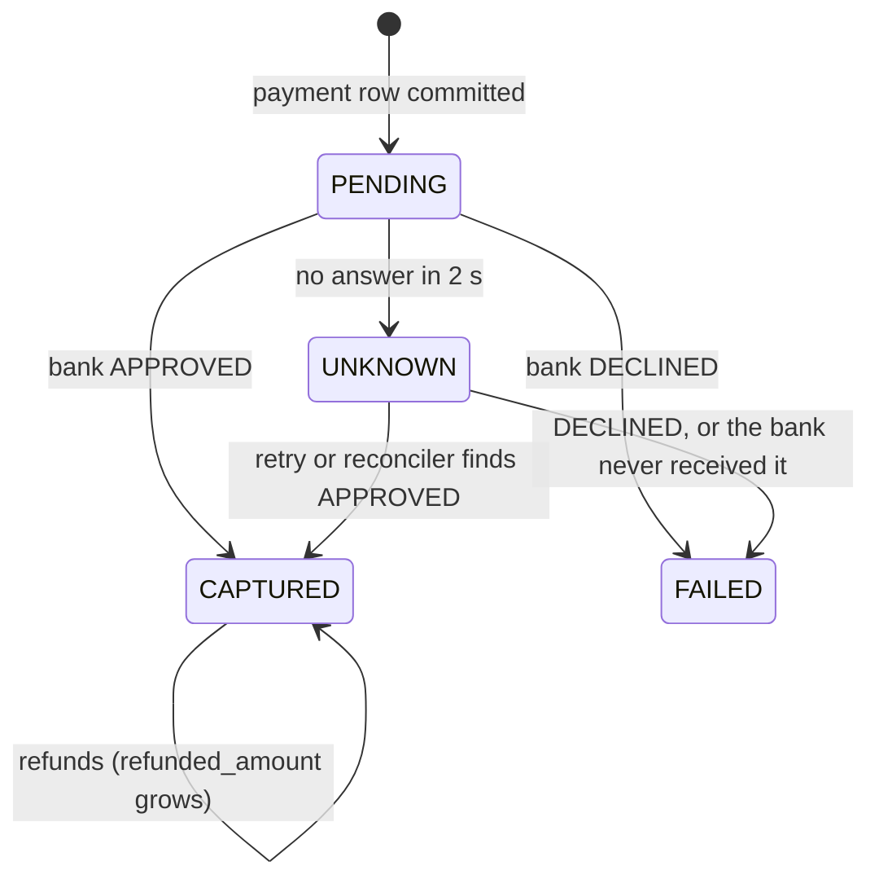
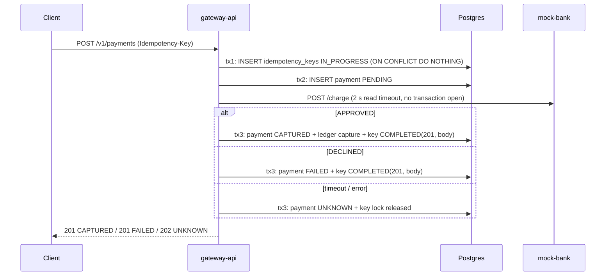

# Ledgerline — Design Notes

## Architecture


| Module | Port | Responsibility |
|---|---|---|
| `gateway-api` | 8080 | Payments REST API, idempotency, double-entry ledger, outbox relay, rate limiting |
| `webhook-dispatcher` | 8081 | Consumes `payment.events`, delivers signed webhooks with retry topics + DLT |
| `mock-bank` | 8082 | Fake card processor: randomly succeeds, fails, is slow, or times out |
| `demo-merchant` | 8083 | Receives webhooks, verifies HMAC, logs them, can be told to fail |

Every app exposes `/actuator/health` (with liveness/readiness probes for Kubernetes) and
`/actuator/prometheus`, and runs request handling on Java 21 virtual threads
(`spring.threads.virtual.enabled=true`). gateway-api serves Swagger UI at `/swagger-ui.html`.

## Decisions

### Project layout
- **Maven multi-module with one parent pom.** The parent inherits `spring-boot-starter-parent` 3.3.13
  so all modules share one dependency set. Dependencies every app needs (web, actuator,
  Prometheus registry, test starter) are declared once in the parent.
- **Dependencies arrive with the features that use them.** For example, Kafka and Redis clients are
  not on the classpath yet, so auto-configuration doesn't try to connect to services nothing uses.

### Database
- **Flyway owns the schema, Hibernate only validates it** (`ddl-auto: validate`). This fits the
  rule that invariants live in Postgres: constraints and triggers are written by hand in SQL
  migrations, never generated. `V1__init.sql` is an empty baseline; `V2__ledger.sql` adds merchants
  and the ledger (see [Ledger](#ledger)); `V3__payments.sql` adds payments, refunds, idempotency keys
  and the demo merchants (see [Payments](#payments)).
- Flyway 10 needs `flyway-database-postgresql` alongside `flyway-core`.
- `open-in-view: false`, so no lazy loading can happen in the web layer, and each transaction
  boundary is explicit in the service layer.

### Testing
- **Unit tests are `*Test` (Surefire); integration tests are `*IT` (Failsafe, run during `mvn verify`).**
  This keeps the fast feedback loop fast, while `mvn verify` still runs everything.
- **Integration tests use real Postgres through Testcontainers**, wired in with `@ServiceConnection`
  (no hand-written JDBC URL properties). An in-memory H2 would hide Postgres-specific behavior
  (constraints, triggers, `SELECT ... FOR UPDATE SKIP LOCKED`), and the ledger depends on exactly that.
- **Docker 29 compatibility.** Testcontainers' bundled docker-java defaults to Docker API 1.32.
  Docker Engine 29 requires at least 1.40 and answers with an empty `400`, which Testcontainers reports as
  "Could not find a valid Docker environment". The parent pom sets `api.version=1.44` as a Failsafe
  system property, so the fix lives in the repo, not in each developer's `~/.docker-java.properties`.
  Testcontainers is also raised to 1.21.x (Boot 3.3 ships 1.20.x).
- **ITs use `@AutoConfigureObservability`.** `@SpringBootTest` disables metrics exporters by default,
  so `/actuator/prometheus` returns 404 in tests unless the annotation re-enables them.
- **gateway-api ITs share one base class, `AbstractGatewayIT`.** It starts one Postgres container and
  one WireMock server in a static block (the "singleton container" pattern) and fixes a single set
  of test properties. Every IT class therefore reuses **one** cached Spring context. With per-class
  `@Container` fields, each class would start its own database, and a cached context could outlive
  the container it points at.
- **The bank is WireMock in gateway ITs, not the real mock-bank.** Tests need exact outcomes, real
  delays (to trigger the 1 s read timeout), and to count how many charges reached the bank
  ("exactly one charge for 20 concurrent requests"). mock-bank has its own tests in its module.

### Local infrastructure (`infra/docker-compose.yml`)
- **Kafka runs single-node KRaft** (`apache/kafka`): one process is both broker and controller, with no ZooKeeper.
- **Two client listeners.** A Kafka client uses the bootstrap address only for its first
  connection. After that it connects to whatever address the broker *advertises*, so a single
  listener can't serve both the host and other containers:
  - `EXTERNAL` → advertised as `localhost:9092`, for apps on the host (IDE, `make run-all`).
  - `INTERNAL` → advertised as `kafka:29092`, for containers on the compose network (the
    inter-broker listener too).
  - `CONTROLLER` → `:9093`, used only for KRaft quorum traffic and never published.
- **Postgres is published on host port 5433**, not 5432, so it doesn't clash with a natively
  installed Postgres (common on dev laptops). Containers still use `postgres:5432`. gateway-api
  defaults to `localhost:5433`, overridable with `DB_URL` / `DB_USERNAME` / `DB_PASSWORD`.
- All services have healthchecks, and `make up` uses `docker compose up --wait`, so it returns only
  once Postgres, Redis and Kafka are ready.

### Security
See [Security](#security-1) under Payments.

## Ledger

Code: `gateway-api/.../ledger/`, schema: `V2__ledger.sql`.

### Model
- **Accounts** hold a cached `balance`. **Journal entries** group **postings**. Each posting
  debits or credits one account by a positive amount (`BIGINT` paise).
- **Sign convention: `balance = credits − debits` for every account.** One rule, with no
  per-account "normal side". Because every entry balances, **the sum of all balances is always 0**,
  and `/verify` reports that sum as the global net.
- **Chart of accounts**

  | Account | Owner | `allow_negative` | Meaning |
  |---|---|---|---|
  | `CUSTOMER_FUNDS` | platform | yes | Clearing account money arrives through. It is debited on capture, so it goes negative by design. |
  | `MERCHANT_PAYABLE` | one per merchant | no | What we owe the merchant. It can never go below 0, so a refund larger than the merchant's balance fails in the DB. |
  | `PLATFORM_FEES` | platform | no | Our revenue. |
  | `REFUNDS` | platform | yes | Seeded, still unused: refunds mirror the capture instead (see [Refunds](#refunds-reversing-entries-that-telescope)). |

- **Capture of A with fee F:** debit `CUSTOMER_FUNDS` A, credit `MERCHANT_PAYABLE` A−F,
  credit `PLATFORM_FEES` F. When F rounds down to 0 (A < 50 paise), the fee posting is left out,
  because postings must be positive. The entry then has two postings instead of three.
- **Platform accounts have `owner_id NULL`** and are seeded by the migration. The unique index
  uses `NULLS NOT DISTINCT` (Postgres 15+); otherwise NULLs never collide and several
  `PLATFORM_FEES` accounts could be created. A CHECK ties the two together:
  `owner_type = 'PLATFORM'` ⇔ `owner_id IS NULL`.
- **Enum-like columns are `TEXT` + `CHECK`**, not Postgres `ENUM` types. Adding a value is a
  one-line migration, and Hibernate maps them with plain `@Enumerated(STRING)`.
- **Single currency (INR) for now.** Accounts carry `currency`, and the commit trigger rejects an
  entry whose postings span currencies. Multi-currency would need one account set per currency.

### Fees: 2% rounded down, without overflow
`Fees.captureFee` uses basis points (200 bp). `amount * 200 / 10_000` overflows `long` above
~4.6·10¹⁶, so the amount is split as `amount = q·10,000 + r` and the fee computed as
`q·200 + r·200/10,000`. This is exact floor division, and neither term can overflow. Unit tests
cover 1 and 49 (fee 0), 50 (fee 1), 99 (rounds down, not up), and `Long.MAX_VALUE`, checked against
`BigInteger`.

### Invariants enforced by Postgres
Java validates the same rules first (`JournalEntryRequest` rejects unbalanced input), but that only
gives nicer errors. The database is the authority:

| Invariant | Mechanism |
|---|---|
| Debits = credits per entry; an entry has ≥ 1 posting; one currency | `DEFERRABLE INITIALLY DEFERRED` constraint triggers on `journal_entries` and `postings` insert, calling `ledger_assert_entry_balanced(entry_id)` |
| Ledger is append-only | `BEFORE UPDATE OR DELETE` row triggers and `BEFORE TRUNCATE` statement triggers on both tables |
| Posting amount > 0 | `CHECK (amount > 0)` |
| No overdraft | `CHECK (allow_negative OR balance >= 0)` on `accounts` |
| A payment is captured at most once | partial unique index `journal_entries(payment_id) WHERE type = 'CAPTURE'` |

- **Why deferred:** the entry row and its postings are separate `INSERT`s, so the entry is
  unbalanced between statements. A deferred trigger checks at `COMMIT`, when the entry is
  complete. The integration test proves this: both raw-SQL inserts succeed, and only `commit()` fails.
- **Why a trigger on `journal_entries` too:** the `postings` trigger only fires if a posting
  exists. Without the second trigger, an entry with no postings at all would commit.
- **Trigger cost:** the check runs once per inserted row, so 4 times per 3-posting capture. Each run
  is an index lookup (~0.25 ms, see below). Bulk-loading 200k entries took 88 s at commit (~110 µs
  per trigger call), which is fine for OLTP but worth knowing for backfills.
- **Error codes:** the triggers raise `check_violation` / `integrity_constraint_violation`, so
  Spring translates them to `DataIntegrityViolationException` like any other constraint.
- **Limitation:** the table owner can still `ALTER TABLE ... DISABLE TRIGGER`. In production the
  app would connect as a role with only `SELECT, INSERT` on the ledger tables, and migrations would run
  as a separate owner role.

### Posting: one transaction, ordered row locks
`LedgerService.post` is `@Transactional` and does, in order:
1. Nets the postings per account in a `TreeMap`, which gives the account ids sorted ascending.
2. `SELECT id FROM accounts WHERE id IN (...) ORDER BY id FOR UPDATE`, which locks every affected
   account. It fails early if an id is unknown.
3. Inserts the entry and its postings.
4. `UPDATE accounts SET balance = balance + :delta, version = version + 1` per account.

- **Why a consistent lock order:** if T1 locks A and waits for B while T2 holds B and waits for A,
  Postgres detects a deadlock and aborts one of them. When every transaction locks in ascending id
  order, that cycle can't form. The plan below shows the `ORDER BY` is satisfied by the primary-key
  index scan under `LockRows`, so rows are locked in id order as they come off the index.
- **Hot rows:** every capture locks `CUSTOMER_FUNDS` and `PLATFORM_FEES`, so all captures across all
  merchants serialize on those two rows for the length of the transaction. This is fine at this
  project's scale. The usual fix is to split each platform account into N sub-accounts and pick one
  at random (sum them for reporting).
- **JPA vs SQL:** `Account` and `Merchant` are JPA entities (lookups, onboarding). The posting path
  is `JdbcClient` SQL, following the rule to use plain SQL where locking matters. `Account.balance`
  is mapped `insertable = false, updatable = false`, so a stale entity can never overwrite a balance.
  `@Version` makes any other JPA update optimistic-locked. `JpaTransactionManager` shares its JDBC
  connection with `JdbcClient`, so both run in the same transaction.
- **The concurrency test** fires 50 captures for one merchant at once on virtual threads, released
  together by a latch through a 10-connection pool. It asserts exact final balances on all three
  accounts, and that `/verify` is clean.
- **What the concurrency test doesn't show:** the `balance = balance + delta` update is atomic by
  itself, so it would not lose updates even without `FOR UPDATE`. The explicit lock matters for code
  that *reads* a balance and then decides, for example a refund checking funds or a payout. It also
  makes the lock order a visible, deliberate step instead of a side effect of update order.

### Cached balances and `/admin/ledger/verify`
The balance is cached on `accounts` so reads are O(1). The postings are the source of truth.
`GET /admin/ledger/verify` returns:
- `allEntriesBalanced` + `unbalancedEntryIds`: groups postings by entry.
- `balancesMatchPostings` + `mismatchedAccountIds`: compares each cached balance with
  credits − debits of its postings.
- `globalNet`: `SUM(accounts.balance)`, which must be 0. This checks the *cache*. The same sum over
  postings would be 0 whenever entries balance, so it would tell us nothing new.
- `consistent`: all of the above.

It runs `@Transactional(readOnly, REPEATABLE_READ)`, so all three queries read one snapshot. A
capture committing between them can't cause a false alarm. It always returns 200; callers
(monitoring, a scheduled job) check `consistent`.

**Trade-off:** cached-balance correctness is *detected* by `/verify`, not *enforced* by Postgres. A
posting-insert trigger could maintain balances itself, but that moves the business logic into
PL/pgSQL and hides it from the service layer. The integration test proves that drift is detected.

### Indexes

Measured on Postgres 16 with 1,003 accounts, 200,000 journal entries, and 600,000 postings (200 per
merchant account, 200,000 each on the platform accounts), after `VACUUM ANALYZE`.

| Index | Used by | With index | Without |
|---|---|---|---|
| `accounts(owner_type, owner_id, type)` UNIQUE `NULLS NOT DISTINCT` | Account lookup in `capture`; uniqueness | 0.11 ms index scan | — (uniqueness needs it anyway) |
| `postings(journal_entry_id)` | Commit-time balance trigger, run on every insert | 0.25 ms | 8.5 ms parallel seq scan, **growing with ledger size, on every write** |
| `journal_entries(payment_id)` | Finding a payment's entries (refunds, support) | 0.14 ms | 17 ms seq scan |
| `postings(account_id)` | Account statements, recomputing one account's balance, FK checks if an account is ever deleted | 1.9 ms (200 rows) | 8.3 ms seq scan |
| `accounts` PK | `SELECT ... FOR UPDATE` lock step | 0.13 ms | — |

**`accounts(owner_type, owner_id, type)`**: both lookups (merchant by id, platform by `IS NULL`) use
all three columns as index conditions:
```
Index Scan using accounts_owner_type_uq on accounts (actual time=0.070..0.071 rows=1 loops=1)
  Index Cond: ((owner_type = 'MERCHANT') AND (owner_id = 500) AND (type = 'MERCHANT_PAYABLE'))
Execution Time: 0.113 ms

Index Scan using accounts_owner_type_uq on accounts (actual time=0.024..0.025 rows=1 loops=1)
  Index Cond: ((owner_type = 'PLATFORM') AND (owner_id IS NULL) AND (type = 'PLATFORM_FEES'))
Execution Time: 0.032 ms
```

**Lock step** (primary key; ordered index scan feeding `LockRows`, no separate sort):
```
LockRows (actual time=0.106..0.116 rows=3 loops=1)
  ->  Index Scan using accounts_pkey on accounts (actual time=0.019..0.025 rows=3 loops=1)
        Index Cond: (id = ANY ('{1,503,2}'::bigint[]))
Execution Time: 0.131 ms
```

**`postings(journal_entry_id)`**: the most important index. The deferred trigger queries postings
by entry for every inserted row. Without the index, each capture would pay 4 sequential scans of
the whole postings table at commit, and that gets slower as the ledger grows. Postgres does not
create indexes on FK columns automatically.
```
Aggregate (actual time=0.167..0.168 rows=1 loops=1)
  ->  Sort (actual time=0.151..0.151 rows=3 loops=1)
        ->  Nested Loop (actual time=0.085..0.115 rows=3 loops=1)
              ->  Bitmap Heap Scan on postings p (actual time=0.076..0.102 rows=3 loops=1)
                    ->  Bitmap Index Scan on postings_journal_entry_id_idx (actual time=0.069..0.069 rows=3 loops=1)
                          Index Cond: (journal_entry_id = 123456)
              ->  Index Scan using accounts_pkey on accounts a (actual time=0.003..0.003 rows=1 loops=3)
Execution Time: 0.245 ms

-- same query without the index:
Parallel Seq Scan on postings p (actual time=1.479..5.655 rows=1 loops=3)
  Filter: (journal_entry_id = 123456)
  Rows Removed by Filter: 199999
Execution Time: 8.463 ms
```

**`journal_entries(payment_id)`**: the refund flow will look up a payment's capture and earlier
refunds by `payment_id`. The partial unique index (`WHERE type = 'CAPTURE'`) can't serve that query
because it only contains captures, so this general index is separate.
```
Index Scan using journal_entries_payment_id_idx on journal_entries (actual time=0.129..0.130 rows=1 loops=1)
  Index Cond: (payment_id = '01b4d174-...'::uuid)
Execution Time: 0.141 ms

-- without: Seq Scan on journal_entries, Rows Removed by Filter: 199999, Execution Time: 17.382 ms
```

**`postings(account_id)`**: merchant account statements and single-account reconciliation. It
also keeps FK checks on `accounts` from scanning `postings`. It pays off for selective accounts
(merchants). For the hot platform accounts, which hold a third of all postings each, the planner
correctly ignores it and seq-scans (12 ms), so platform-level reporting should read the cached
balance, not sum postings.
```
Aggregate (actual time=1.892..1.892 rows=1 loops=1)
  ->  Index Scan using postings_account_id_idx on postings (actual time=0.030..1.853 rows=200 loops=1)
        Index Cond: (account_id = 503)
Execution Time: 1.900 ms

-- without: Parallel Seq Scan on postings, Rows Removed by Filter: 199933, Execution Time: 8.255 ms
```

**`/verify` queries are full scans on purpose.** An audit has to read every posting, so no index
can make it cheaper. Measured: unbalanced-entry check 274 ms (the planner walks
`postings_journal_entry_id_idx` to feed a streaming `GroupAggregate`); balance-mismatch check 31 ms
(parallel seq scan + hash aggregate, merge-joined to the accounts PK); global net 0.1 ms. That is
acceptable for an operator endpoint or nightly job. At a much larger scale, verification would run
incrementally (only entries since the last checkpoint) or on a read replica.

### Why it's built this way (interview notes)

#### Why double-entry?
Single-entry bookkeeping is `merchant.balance += 9800`. If a bug skips the fee credit, or credits
twice, nothing notices: the number is just wrong, and there is no history to explain it.

Double-entry records every movement as a journal entry whose debits equal its credits. Money is
never created or destroyed, only moved between accounts. That gives three things:
1. **A built-in checksum.** All balances must sum to 0. Any code path that "forgets the other side"
   breaks this and `/verify` catches it.
2. **An audit trail.** The postings *are* the history. Every balance can be recomputed and
   explained line by line ("why is this merchant owed ₹98?" → these postings).
3. **Immutability.** Mistakes are fixed with a reversing entry, never by editing. The past stays
   true, which is what auditors, reconciliation with the bank, and disputes need.

The cached balance is an optimisation on top. The postings are the source of truth.

#### Why a deferred constraint trigger instead of (only) a Java check?
- **A Java check protects one code path; the database protects all of them.** Raw SQL fixes in
  `psql`, a future second service, a data migration, a refactor that bypasses `LedgerService`: none
  of them go through the Java check. The trigger applies to every writer. The Java check is still
  there, for a fast, clear error and a unit-testable rule.
- **Why a trigger, not a `CHECK`:** a `CHECK` constraint only sees the row being written.
  "Debits = credits" is a rule across many rows. The SQL standard's `CREATE ASSERTION` would express
  it, but Postgres doesn't implement it. A constraint trigger is the Postgres way to get a
  cross-row constraint.
- **Why deferred:** an entry is written with several `INSERT`s (entry, then each posting). After the
  first posting it is unbalanced *by construction*, so an immediate check would reject every valid
  entry. `DEFERRABLE INITIALLY DEFERRED` runs the check at `COMMIT`, when the entry is complete. If
  it fails, the whole transaction rolls back, including the balance updates.

#### Why lock rows in id order?
A deadlock needs a cycle: T1 holds A and waits for B, while T2 holds B and waits for A. Postgres
detects it after `deadlock_timeout` (1 s by default) and aborts one transaction with `40P01`. That
means a failed payment and a one-second latency spike.

If every transaction acquires locks in the same global order (ascending account id), a cycle is
impossible. A transaction only ever waits for a lock with a *higher* id than every lock it holds, so
the wait-for chain can't loop back. Reproduced on Postgres 16, with two transactions updating accounts
1 and 2:

| Lock order | Result |
|---|---|
| T1: 1 then 2, T2: 2 then 1 | T1 aborted: `ERROR: deadlock detected` |
| Both: 1 then 2 | T2 waits for T1, then both commit |

Details that come up in interviews:
- The order only protects you if **every** code path follows it, including refunds and payouts.
  That's why locking is one explicit step in `LedgerService.post`, not scattered updates.
- `ORDER BY id ... FOR UPDATE` locks rows in output order. Postgres warns that rows can come back
  out of order if the sort key changes while waiting. `id` never changes, so that can't happen here.
- Taking all locks **up front, before any writes** also means no work is thrown away halfway if a
  lock can't be taken.
- `FOR NO KEY UPDATE` would be a slightly weaker, sufficient lock, because we never change the key.
  It doesn't block other transactions' FK checks (`FOR KEY SHARE`) from inserting postings that
  reference the account. Since every writer here locks first anyway, `FOR UPDATE` is kept for clarity.

#### What would break with READ COMMITTED and no `FOR UPDATE`?
In READ COMMITTED (the Postgres default, and what `post()` runs in), **each statement** sees a new
snapshot of committed data. Measured on Postgres 16, with two concurrent transactions each adding
9,800 to a balance of 0:

| Pattern | Final balance | Why |
|---|---|---|
| App reads balance, computes, writes `balance = :value` | **9,800** (lost update) | Both read 0, both write 9,800. The second write overwrites the first. |
| `UPDATE SET balance = balance + 9800` (what `post()` does) | 19,600 ✓ | The second `UPDATE` waits for the row lock, then **re-evaluates against the newly committed row** before applying `+ 9800`. |
| Read with `FOR UPDATE`, compute, write | 19,600 ✓ | The second reader waits for the lock and then reads the committed 9,800. |

So in *today's* code, removing `FOR UPDATE` would **not** lose balance updates, because the atomic
increment is safe on its own. What breaks is anything that **reads, decides, then writes**:
- **Refund limits** ("total refunds ≤ captured amount"). Two refunds of ₹60 on a ₹100 capture each
  read "refunded so far = 0", each pass the check, and both insert. The measured result is 120
  refunded. Neither transaction updated a row the other read, so nothing conflicts.
- **Funds checks** ("merchant has enough for this payout"). The `balance >= 0` CHECK still stops a
  negative balance, but the user gets a constraint-violation error instead of a clean
  "insufficient funds", and rules that aren't single-row CHECKs aren't protected at all.
- **Deadlock safety becomes accidental.** It depends on the update loop happening to iterate in id
  order, instead of being a deliberate step.
- A read-modify-write in Java (loading the `Account` entity, `setBalance`, save) would lose
  updates outright. `/verify` would report the account as mismatched, because the postings would
  still sum correctly.

The fix for the refund race under READ COMMITTED is to lock a common parent row (the payment, or the
merchant's account) `FOR UPDATE` **before** reading the refund total. Measured result: 60 refunded,
and the second refund is rejected. It works because after waiting for the lock, READ COMMITTED's
*next statement* takes a fresh snapshot that includes the first refund.

#### READ COMMITTED vs REPEATABLE READ vs SERIALIZABLE in Postgres
All three results below were reproduced with two concurrent `psql` sessions on Postgres 16.

| Level | Snapshot | Lost update (read-modify-write) | Write skew (refund race) | Must retry on `40001`? |
|---|---|---|---|---|
| READ COMMITTED | New one per **statement** | **Happens** (9,800 instead of 19,600) | **Happens** (120 refunded) | No |
| REPEATABLE READ | One per **transaction** (snapshot isolation) | Prevented: second writer gets `could not serialize access due to concurrent update` | **Happens** (120 refunded) | Yes |
| SERIALIZABLE | One per transaction + conflict detection (SSI) | Prevented | Prevented: second gets `could not serialize access due to read/write dependencies among transactions` (60 refunded) | Yes |

- **READ COMMITTED.** No transaction-wide snapshot, so two reads in one transaction can disagree
  (non-repeatable reads, phantoms). Concurrent writers to the same row are serialized by the row lock
  and re-evaluate their `WHERE`/`SET` against the latest version. Correctness for read-then-write
  logic needs explicit locks.
- **REPEATABLE READ.** Every statement sees the snapshot taken at the transaction's first
  statement. In Postgres this also prevents phantoms, which is stronger than the SQL standard
  requires. If you try to update or lock a row that someone else changed and committed after your
  snapshot, you get `40001` instead of silently overwriting. So lost updates become errors. **Write
  skew still gets through:** each transaction reads the same data, then writes *different* rows (two
  new refund rows), so there is no write-write conflict to detect.
- **SERIALIZABLE.** Adds predicate locks ("SIRead" locks) that track what each transaction *read*.
  If transaction A read something that B then wrote, and B read something that A then wrote, that's a
  dangerous cycle, and Postgres aborts one of them. It's the only level where "each transaction is
  correct alone ⇒ correct together" holds with no manual locking. The costs: you must retry
  `40001`; there are false positives (sequential scans take relation-level predicate locks and
  conflict more, so good indexes matter); and there's memory overhead for predicate locks.

**Surprise found while measuring:** under REPEATABLE READ, locking the parent row first did **not**
fix the refund race. The result was still 120. T2's snapshot was taken by its first statement
(the `FOR UPDATE`) *before* T1 committed. When T1 committed, T2 got the lock, but T1 had only locked
the row, not updated it, so there was no conflict to raise, and T2's `SUM` still read its old
snapshot. The "lock the parent row" pattern relies on READ COMMITTED's per-statement snapshot. Under
REPEATABLE READ, the parent row must actually be *updated* (then the second transaction gets
`40001`), or you use SERIALIZABLE. In this ledger, every refund would `UPDATE` the merchant account's
balance, so REPEATABLE READ would raise `40001` there. But that protection would be a side effect
of the balance update, and it's better not to rely on it.

**What Ledgerline uses:** READ COMMITTED + explicit `FOR UPDATE` in a fixed order for money
movement. It needs no retry loop, the behaviour is easy to reason about, and on hot rows blocking is
cheaper than repeated aborts. `/verify` uses REPEATABLE READ, because it's read-only and only needs
one consistent snapshot across its three queries.

#### Optimistic (`@Version`) vs pessimistic (`FOR UPDATE`) locking
- **Optimistic:** no lock is held while working. The write is
  `UPDATE ... SET ..., version = version + 1 WHERE id = ? AND version = ?`. If 0 rows are affected,
  someone else got there first, and JPA throws `OptimisticLockException`. You then retry or return
  `409 Conflict`.
- **Pessimistic:** take the row lock before reading. Others wait instead of failing.

| Pick optimistic when | Pick pessimistic when |
|---|---|
| Conflicts are **rare** (different users editing different things) | Conflicts are **common**: hot rows like `PLATFORM_FEES`, which every capture touches |
| The "transaction" spans **user think time** or several HTTP requests. You can't hold a DB lock while someone edits a form | The critical section is **short** and entirely inside one DB transaction |
| Failing with "someone else changed this, reload" is an acceptable answer | The operation **must succeed** and retries are costly or have side effects |
| Reads vastly outnumber writes | You need to read-then-decide on current data (funds and limit checks) |

Why not optimistic for the ledger: with 50 concurrent captures on the same accounts, only one
wins each round and the other 49 retry. That's roughly n² attempts, the retry storm gets worse
exactly when load is highest, and each retry re-runs the whole transaction. Pessimistic locking
queues them instead: each waits once, and all 50 succeed.

The costs of pessimistic locking: waiting holds a pooled connection, and a slow lock holder
stalls everyone behind it. So **never hold a row lock across a network call**. The call to
mock-bank happens *before* the ledger transaction, never inside it. Keep the locked section to a
few milliseconds of SQL.

In this project: the ledger uses pessimistic locking. `Account` still carries `@Version`, so any
future JPA edit of an account (such as toggling `allow_negative`) fails loudly instead of
overwriting a concurrent change. Merchant profile edits (webhook URL, tier) are the textbook
optimistic case: rare conflicts, and a human in the loop.

### Testing
- **Unit (`FeesTest`, `LedgerServiceTest`, Mockito):** fee rounding edge cases; exact postings
  built for a capture (including the dropped zero-fee posting and `Long.MAX_VALUE`); lock-then-write
  ordering (`InOrder`) with sorted ids; netting of repeated accounts; unknown accounts fail before
  any write.
- **Integration (`LedgerIT`, Testcontainers Postgres 16):** balanced capture; unbalanced raw-SQL
  entry fails at `commit()`; entry without postings fails; `UPDATE`/`DELETE`/`TRUNCATE` on
  `postings` and `journal_entries` fail; double capture and overdraft are rejected and roll back;
  50 concurrent captures; `/verify` clean, and detects deliberately corrupted balances.
- Ledger rows can't be deleted, so ITs don't clean up. Each test creates its own merchant and
  asserts on *changes* to the shared platform accounts.

## Mock bank

Code: `mock-bank/.../bank/`.

- `POST /charge {paymentId, amount, cardToken}` → `APPROVED` or `DECLINED`. `GET /charges/{paymentId}`
  → the stored result, or 404 if the bank never received that charge.
- **Outcomes by rate** (`bank.*`, overridable with `BANK_*` env vars): 85% approve, 10% decline, 5%
  timeout, and 50–300 ms of latency. The three rates must sum to 1, which is checked when
  `BankProperties` is constructed, so a typo fails at startup instead of skewing results quietly.
- **A timeout still has an outcome.** The bank decides (with the approve:decline odds), **stores the
  decision, then** sleeps 5 s, past the gateway's 2 s read timeout. The card has been charged but the
  caller never hears about it. That is the realistic worst case, and the reason the gateway has
  `UNKNOWN` and a reconciler.
- **Idempotent on `paymentId`:** `ConcurrentHashMap.putIfAbsent`. Two concurrent first requests
  for the same id share one decision, and a retry returns the stored decision immediately, without
  sleeping again. Reusing an id with a different amount or card is a 409.
- **Magic card tokens** `tok_approve`, `tok_decline`, `tok_timeout` override the dice, for demos.
- **Randomness and sleeping are injected** (`RandomGenerator`, `Sleeper`), so unit tests are
  deterministic and never wait.
- **Trade-off:** charges live in memory and a restart forgets them. After a restart, the reconciler's
  lookup of an old UNKNOWN payment gets 404 and marks it FAILED, even though the "bank" had approved
  it. That is fine for a mock. A real processor keeps this record durably, and that durability is
  what the whole reconciliation design relies on.

## Payments

Code: `gateway-api/.../payment/`, `.../idempotency/`, `.../security/`; schema: `V3__payments.sql`.

### Security
One stateless `SecurityFilterChain` (no sessions, CSRF off: no cookies means nothing for CSRF to
ride on), with three ways in:

| Credential | Filter / mechanism | Role | Paths |
|---|---|---|---|
| `X-Api-Key` | `ApiKeyAuthenticationFilter` → `ApiKeyAuthenticationProvider` | `MERCHANT` | `/v1/**` |
| `X-Service-Token` | `ServiceTokenAuthenticationFilter` → `ServiceTokenAuthenticationProvider` | `SERVICE` | `/internal/**` |
| HTTP Basic | Spring's `BasicAuthenticationFilter` → `DaoAuthenticationProvider` | `ADMIN` | `/admin/**` |

Public: `/actuator/health/**`, `/actuator/prometheus`, `/v3/api-docs/**`, `/swagger-ui/**`. Everything
else is `denyAll()`.

- **API keys are stored as SHA-256 hex, looked up by hash** through the existing unique index on
  `merchants.api_key_hash` (0.04 ms, see below). A fast unsalted hash is correct here, unlike for
  passwords. Keys are long random strings with no dictionary to attack, and the hash must be
  deterministic to be indexable. bcrypt would need a scan and ~100 ms of CPU per request.
- **The service token is compared with `MessageDigest.isEqual`** (constant time). `String.equals`
  returns at the first wrong byte, which leaks through timing how much of a guess was right.
- **Why one chain, not one per path:** a merchant key sent to `/admin/**` should get **403** ("we know
  who you are; you can't do this"). With a separate admin chain that only knows Basic, the merchant
  key would be ignored and the answer would be 401.
- **A bad credential is rejected in the filter (401 immediately); a missing one continues as
  anonymous**, and the authorization rules decide. So public endpoints work without headers, and a
  typo'd key never falls through to anonymous access.
- **The `AuthenticationManager` is built by hand** from all three providers. Gotcha: if a custom
  `AuthenticationProvider` is exposed as a bean, Spring Boot stops wiring the `UserDetailsService`
  into its default manager, and HTTP Basic silently stops working.
- **401/403 bodies use the same `{error: {code, message}}` format.** Security errors happen in the
  filter chain before any controller, so `@RestControllerAdvice` never sees them. The entry point and
  access-denied handler in `JsonSecurityErrorHandler` write the JSON themselves.
- **Another merchant's payment is a 404, not a 403.** Every lookup is `WHERE id = ? AND merchant_id = ?`
  (`findByIdAndMerchantId`). A 403 would confirm that the id exists. With a 404, other merchants'
  payments are simply invisible.
- **`/actuator/prometheus` is public** so Prometheus can scrape without credentials, which is the usual
  in-cluster setup. The ingress must not route it publicly.
- Demo credentials are dev defaults in `application.yml`, overridable by env vars. The three demo
  merchants' raw keys are only in README.md, and the migration holds only their hashes.

### State machine



Enforced three times, from friendliest to strictest: `Payment.capture/fail/markUnknown` throw on an
illegal move; `@Version` makes two concurrent transitions conflict instead of overwriting each other;
and the `payments_status_transition` trigger rejects illegal moves from any writer. `CHECK`s cap
`refunded_amount` at `amount` and allow it only on CAPTURED payments.

### Creating a payment



- **`PaymentService` is not `@Transactional`.** Each DB step is its own short transaction in
  `PaymentTransitions` / `IdempotencyService`, and the bank call sits **between** transactions. No
  connection or row lock is held while waiting on the network (see "never hold a row lock across a
  network call" in the ledger notes). Separate beans also avoid Spring's self-invocation trap, where
  calling a `@Transactional` method on `this` skips the proxy.
- **The approval is one transaction:** payment → CAPTURED, the ledger capture entry, and the key →
  COMPLETED with the response. If any part fails, all of it rolls back, and the payment stays
  PENDING/UNKNOWN for a retry or the reconciler. There is no state where money is in the ledger but
  the key still says "in progress", or the reverse.
- **The PENDING row is committed before the bank call**, so if the process dies mid-call the
  reconciler can still find the payment.
- **`saveAndFlush` before the ledger:** a concurrent transition fails on `@Version` before the
  ledger's account locks are taken. It also means the payment row is locked **before** the accounts,
  the same order refunds use (`FOR UPDATE` on the payment first), so the two paths can't deadlock.
- **The payment id is a UUID generated in the app,** so the same id goes to the bank and becomes the
  bank's idempotency key.
- **A declined card is `201` with status FAILED**, not a 402 error. The payment resource was
  created, and its status says what happened, so the response body always has one shape.
- **Currency:** only INR has ledger accounts, so anything else is a 422, checked *before* the key is
  claimed.

### Idempotency
`idempotency_keys(merchant_id, key, request_hash, status, response_code, response_body JSONB,
created_at, locked_until)`, `UNIQUE (merchant_id, key)`. An IN_PROGRESS row is a **lock with an
expiry**; a COMPLETED row holds the response to replay.

| Existing row | Same request hash | Different hash |
|---|---|---|
| none | insert → go | — |
| COMPLETED | **replay** stored response + `Idempotent-Replayed: true` | **422** `IDEMPOTENCY_KEY_REUSED` |
| IN_PROGRESS, `locked_until` in the future | **409** `IDEMPOTENCY_KEY_IN_USE` | 422 |
| IN_PROGRESS, lock expired or released | **take over** (atomic `UPDATE ... WHERE locked_until <= now()`) → go; lost the race → 409 | 422 |

- **`INSERT ... ON CONFLICT DO NOTHING` instead of catching the unique violation.** Same semantics,
  but a failed INSERT aborts the whole Postgres transaction (every later statement errors until
  rollback), while `DO NOTHING` just reports 0 rows. If another transaction inserted the same key and
  hasn't committed yet, the INSERT **waits** for it, then does nothing. That's why 20 simultaneous
  requests produce exactly one winner.
- **The hash is compared first.** A key reused for a different request is a client bug, whatever
  state the first request is in.
- **Request hash = SHA-256 of `METHOD path` + the parsed DTO re-serialized.** Hashing the parsed
  request, not raw bytes, means whitespace or field order in the client's JSON doesn't turn an
  identical retry into a 422 (tested). Including the path means one key can't be reused across
  endpoints, e.g. a payment and a refund.
- **Lock expiry uses Postgres' `now()`**, not the app clock, so all instances agree. The `IdempotencyRecord` gets
  `locked_until <= now()` as a computed boolean, which keeps the decision a pure function
  (`IdempotencyService.decide`) that's unit-tested without a clock.
- **JSONB gotcha:** `response_body` is JSONB, which stores objects in its own key order (by length,
  then alphabetically). Returning the stored text would reorder the fields, so replays wouldn't be
  byte-identical. The replay deserializes the stored JSON back into the endpoint's response record and
  re-serializes it. The integration test asserts byte-for-byte equality.
- **What gets stored:** only requests that *had an effect*. A declined payment is stored (a FAILED
  payment exists). A refund rejected before changing anything (404, not refundable, over-refund) has
  its key row deleted, so the client can fix the amount and retry with the same key. A crash
  mid-request needs no cleanup: the lock expires after `lock-ttl` (10 s) and a retry takes over.
- **Not built yet:** expiring old keys (Stripe keeps them 24 h). It would be a nightly
  `DELETE ... WHERE created_at < now() - interval '24 hours'` job with an index on `created_at`.

### Timeouts, UNKNOWN, and the reconciler
A timeout is **not** a decline. The bank may have charged the card and only the response was lost.
Marking it FAILED would let the customer pay twice (they'd retry with another card), so the payment
becomes **UNKNOWN**, and the response is **202** with that status.

Two things resolve it, and both rely on mock-bank being idempotent on `paymentId`:
1. **The client retries with the same Idempotency-Key.** The UNKNOWN step *released* the key's lock,
   so the retry takes it over, **finds the payment it created before** (`UNIQUE (merchant_id,
   idempotency_key)` on payments), and charges the same `paymentId` again. The bank returns its
   stored decision instead of charging twice, and the retry records it. Tested: two `/charge` calls
   with the same `paymentId`, one payment, one ledger entry.
2. **`PaymentReconciler`** runs every 10 s. It takes UNKNOWN payments, and PENDING ones left behind
   by a crash, once they've been unresolved for 5 s. For each one it calls `GET /charges/{id}` and
   records the answer. 404 means the bank never received the charge, so no money moved → FAILED
   (`not_received_by_bank`). It also completes the idempotency key, so a late client retry gets the
   final answer as a replay.

**The key lock is the mutex.** Before touching a payment, the reconciler takes that payment's
idempotency-key lock, exactly like a client retry does. So a retry and the reconciler (or two
reconciler instances) can never drive the same payment at once. Without this, the reconciler could
see 404 and mark FAILED while a concurrent retry's charge was being approved. If the bank is
unreachable, the reconciler releases the lock and tries again next run. `@Version` is a second guard.

- **Why the lock TTL (10 s) must exceed the slowest request:** a request past its TTL could lose its
  lock to the reconciler while still waiting on the bank. The bank read timeout (2 s) bounds every
  request, which leaves plenty of margin.
- **Why the reconciler's query has literal statuses:** `WHERE status IN ('PENDING', 'UNKNOWN')` has
  to match the partial index's predicate. With bind parameters, a cached generic plan can't prove the
  match and can't use the index. That's also why it's SQL (`PaymentQueryRepository`), not a derived
  JPA query.
- **Why the JDK HTTP client is pinned to HTTP/1.1:** on plain HTTP it otherwise attempts an h2c
  upgrade, and WireMock's Jetty answered with `RST_STREAM`, which surfaced as random "bank
  unavailable" errors in tests. An internal JSON call gains nothing from HTTP/2.
- **Virtual threads:** request handling runs on virtual threads (`spring.threads.virtual.enabled`), so a
  request blocked on the bank for 2 s parks its virtual thread instead of occupying one of Tomcat's
  200 platform threads. The blocking `RestClient` code stays simple.

### Refunds: reversing entries that telescope
`POST /v1/payments/{id}/refunds {amount}` (idempotent, same mechanism). A refund is the **mirror image
of the capture**: credit `CUSTOMER_FUNDS`, debit `PLATFORM_FEES` for the fee returned, debit
`MERCHANT_PAYABLE` for the rest. So the fee is returned along with the payment.

**Returning the fee without rounding drift.** Rounding each partial refund's fee on its own leaks:
49 + 49 refunded returns 0 + 0, although the fee on 98 was 1. Instead,
`Fees.refundFee(before, amount) = fee(before + amount) − fee(before)`. The sum telescopes, so however
a payment is split into refunds, the fees returned add up to **exactly** the capture fee. Each step
is ≥ 0 because the fee never decreases as the amount grows. A full refund therefore leaves the
merchant with exactly what the payment credited. Without this, a merchant with no other balance
could hit the `balance >= 0` CHECK on its last refund. (`FeesTest` splits 9,999 into
49 + 49 + 1 + 9,900 and checks the total is 199.)

**One transaction, payment row locked first:** `SELECT ... FOR UPDATE` on the payment → must be
CAPTURED (409) → `amount ≤ amount − refunded_amount` (422) → insert refund → bump
`refunded_amount` → reversing ledger entry → key COMPLETED. The lock is the "lock a common parent
row" fix measured in the ledger notes: under READ COMMITTED, the second of two concurrent refunds
waits, then reads the refunded amount the first one committed. Tested with 5 concurrent refunds of
6,000 on a 10,000 payment: exactly one succeeds. `CHECK (refunded_amount BETWEEN 0 AND amount)` is the
database backstop even if the Java check were bypassed (also tested).

Simplification: refunds don't call the bank. A real gateway would send a refund to the processor
and could hit the same timeout problem there.

### Listing: keyset pagination
`GET /v1/payments?status=&from=&to=&cursor=&limit=` returns `{data, nextCursor}`, newest first.

- **Keyset, not OFFSET.** The cursor is the `(created_at, id)` of the last row returned, and the next
  page is `WHERE (created_at, id) < (:ts, :id) ORDER BY created_at DESC, id DESC LIMIT n+1`. The row
  comparison is an index condition, so page 5,000 costs the same as page 1. OFFSET has to walk and
  throw away every skipped row, and it shows duplicates or skips rows when payments arrive between page loads.
- **`id` breaks ties** between payments created in the same microsecond. Without it, rows sharing a
  timestamp at a page boundary would be skipped or repeated. The IT seeds duplicate timestamps and
  checks that walking all pages returns every payment exactly once, compared against Postgres' own
  `ORDER BY` (Java's `UUID.compareTo` orders differently from Postgres' uuid comparison).
- **One extra row** (`LIMIT n+1`) says whether there is a next page, with no `COUNT(*)`.
- **The cursor is opaque** (base64url of `epochMicros:uuid`) so it can change format later. It keeps
  microseconds, because that's Postgres' precision. `Payment` truncates its timestamps to microseconds
  so the entity equals what is read back.
- Written as SQL in `PaymentQueryRepository`, so the statement is exactly the one measured below.

#### EXPLAIN ANALYZE on 1M payments
Postgres 16 (`postgres:16`, default settings), 1,000,000 payments from `infra/scripts/seed-payments.sql`:
Chai Point 599,332, Book Nook 300,438, Pixel Prints 100,232, spread over 365 days, 88% CAPTURED.
After `VACUUM ANALYZE`, warm cache. Queried as Chai Point, `LIMIT 21` (page size 20 + 1).
Reproduce with `make seed-payments explain-payments`.

| Query | Without `payments_merchant_created_idx` | With it |
|---|---|---|
| First page | 55.9 ms, parallel seq scan + top-N sort | **0.045 ms**, index scan, 23 buffers |
| Page 5,001 (cursor 100,000 rows deep) | 53.0 ms, parallel seq scan + top-N sort | **0.036 ms**, index scan, 24 buffers |
| Page 5,001 with `OFFSET 100001` instead | — | 206.5 ms, index scan reading 100,022 rows, 100,822 buffers |
| `status=FAILED`, first page | 28.9 ms | **0.33 ms**, index scan + filter (200 rows skipped) |

Without the index, every page is a full scan of the table, sorting all of the merchant's ~600k rows
for the top 21:
```
Limit (actual time=52.850..55.848 rows=21 loops=1)
  ->  Gather Merge (actual time=52.849..55.845 rows=21 loops=1)
        Workers Launched: 2
        ->  Sort (actual time=51.506..51.508 rows=19 loops=3)
              Sort Key: created_at DESC, id DESC
              Sort Method: top-N heapsort  Memory: 29kB
              ->  Parallel Seq Scan on payments (actual time=0.024..30.413 rows=199777 loops=3)
                    Filter: (merchant_id = 1)
                    Rows Removed by Filter: 133557
Execution Time: 55.868 ms
```
The planner ignores `UNIQUE (merchant_id, idempotency_key)` here even though it starts with
`merchant_id`. This merchant is 60% of the table, and that index has no useful order, so a seq scan
plus sort is cheaper.

With the index, the deep page reads 21 index entries. The cursor is part of the `Index Cond`, and
there is no Sort node because the index is already in `created_at DESC, id DESC` order:
```
Limit (actual time=0.009..0.032 rows=21 loops=1)
  Buffers: shared hit=21 read=3
  ->  Index Scan using payments_merchant_created_idx on payments (actual time=0.009..0.031 rows=21 loops=1)
        Index Cond: ((merchant_id = 1) AND (ROW(created_at, id) < ROW('2026-07-29 05:43:10.929081+00'::timestamptz,
                     '5179cba9-9064-4c60-9b12-9906e6a2020a'::uuid)))
Execution Time: 0.036 ms
```
The same page with OFFSET, even with the index, walks and discards 100,001 rows:
```
Limit (actual time=206.510..206.526 rows=21 loops=1)
  Buffers: shared hit=83069 read=17753 written=10884
  ->  Index Scan using payments_merchant_created_idx on payments (actual time=0.003..203.836 rows=100022 loops=1)
        Index Cond: (merchant_id = 1)
Execution Time: 206.534 ms
```
**Status filter trade-off:** `status` is a filter on the same index, so the query reads rows in date
order until it has 21 matches. At 12% FAILED that means ~220 rows (0.33 ms). For a rare status, it
could read most of the merchant's rows. If filtered listing gets slow, add
`(merchant_id, status, created_at DESC, id DESC)`, at the cost of one more index to update on every
insert and status change.

#### Other indexes used by payment endpoints and jobs
Same 1M-row database:

| Query | Index | Time |
|---|---|---|
| API-key authentication (`findByApiKeyHash`, every request) | `merchants_api_key_hash_key` (UNIQUE) | 0.036 ms |
| `GET /v1/payments/{id}` (`findByIdAndMerchantId`) | `payments_pkey`, then filter on `merchant_id` | 0.036 ms |
| Retry finds its payment (`findByMerchantIdAndIdempotencyKey`) | `payments_merchant_id_idempotency_key_key` (UNIQUE) | 0.13 ms |
| Idempotency claim / lookup / take-over | `idempotency_keys_merchant_id_key_key` (UNIQUE) | 0.45 ms |
| Reconciler batch | `payments_unresolved_idx` (partial: `WHERE status IN ('PENDING','UNKNOWN')`) | 0.018 ms |
| Refunds of a payment; the `refunds.payment_id` FK | `refunds_payment_id_idx` | — (tiny table) |

```
Index Scan using payments_unresolved_idx on payments (actual time=0.011..0.012 rows=0 loops=1)
  Index Cond: (updated_at <= (now() - '00:00:05'::interval))
  Buffers: shared read=1
Execution Time: 0.018 ms
```
**Why a partial index for the reconciler:** it only ever wants the handful of unresolved payments.
A partial index contains only those rows, so it stays one or two pages however many millions of
settled payments exist. A payment leaves the index automatically when it becomes CAPTURED or FAILED.

### Errors and OpenAPI
- **One error shape everywhere:** `{"error": {"code", "message"}}`. `GlobalExceptionHandler` maps
  `ApiException` (the code and status come from the service), bean-validation failures (field-level
  messages), missing `Idempotency-Key`, malformed JSON, `@Version` conflicts (409 `CONCURRENT_UPDATE`),
  and Spring MVC's own exceptions (404/405/415 keep their status). Anything else is a logged 500 with
  a generic message, so internals never leak.
- **Gotcha:** once a controller method has constraint annotations on plain parameters (`@Size` on the
  `Idempotency-Key` header, `@Min` on `limit`), Spring 6.1 validates the whole method in one pass. A
  bad `@Valid` body then arrives as `HandlerMethodValidationException` with `ParameterErrors`, not as
  `MethodArgumentNotValidException`. The handler reads field errors from both.
- **springdoc:** security schemes `ApiKey` (header `X-Api-Key`), `AdminBasic` and `ServiceToken`, so
  Swagger UI's Authorize button works for every endpoint. `Idempotency-Key` is documented as a
  required header with its replay/409/422 semantics. Every status code has an `ApiError` schema and
  an example, and the `Idempotent-Replayed` response header is documented. `GatewayApiApplicationIT`
  checks all of these appear in `/v3/api-docs`.

### Testing
- **Unit (Mockito):** `PaymentServiceTest` (approve → recorded; decline → recorded; timeout → UNKNOWN
  and never "failed"; replay never calls the bank; a take-over re-drives the *existing* payment; a
  payment the reconciler already resolved is returned without charging; currency check happens before the
  key is claimed; a rejected refund frees its key). `IdempotencyServiceTest` (new / replay / 409 /
  422, including 422 while in progress / take-over / take-over lost; replay rebuilds the body from
  JSONB-ordered JSON). `RefundServiceTest`, `PaymentCursorTest`, `ApiKeyAuthenticationProviderTest`,
  plus refund cases in `LedgerServiceTest` and `FeesTest`. mock-bank: `ChargeServiceTest`.
- **Security (`SecurityIT`, MockMvc + spring-security-test `httpBasic()`):** no key / bad key → 401;
  the seeded demo key works; merchant A reading B's payment → 404; merchant key on `/admin` → 403;
  admin → 200; wrong admin password → 401; admin on `/v1` → 403; `/internal` without, with wrong, and
  with the right token; public endpoints; unknown paths denied.
- **Integration (Testcontainers Postgres + WireMock bank):**
  - `PaymentIdempotencyIT`: same key twice → one `/charge` call, byte-identical bodies, replay header,
    one ledger entry; different body → 422; reformatted JSON → still a replay; **20 concurrent
    requests with one key** (300 ms bank delay) → exactly 1 bank call, 1 payment, 1 ledger entry,
    others 409 or replay; decline stored and replayed; validation and missing-header errors.
  - `PaymentReconcilerIT`: timeout → 202 UNKNOWN → reconciler finds APPROVED → CAPTURED + ledger +
    later retry replays; bank never saw it → FAILED; client retry after timeout re-drives the same
    payment; bank down during reconciliation → stays UNKNOWN, resolved on the next run.
  - `RefundIT`: partial + full refunds return the whole fee and leave the merchant at exactly 0,
    ledger consistent; over-refund → 422, no ledger change, key reusable; concurrent refunds can't
    over-refund; idempotent replay; FAILED payment → 409; another merchant's → 404; DB CHECK blocks
    over-refund from raw SQL.
  - `PaymentListIT`: walk every page with duplicate timestamps; status and time filters; other
    merchants' payments never appear; bad cursor / limit / status → 400.
- `mvn -q clean verify` runs 135 tests across the modules.
